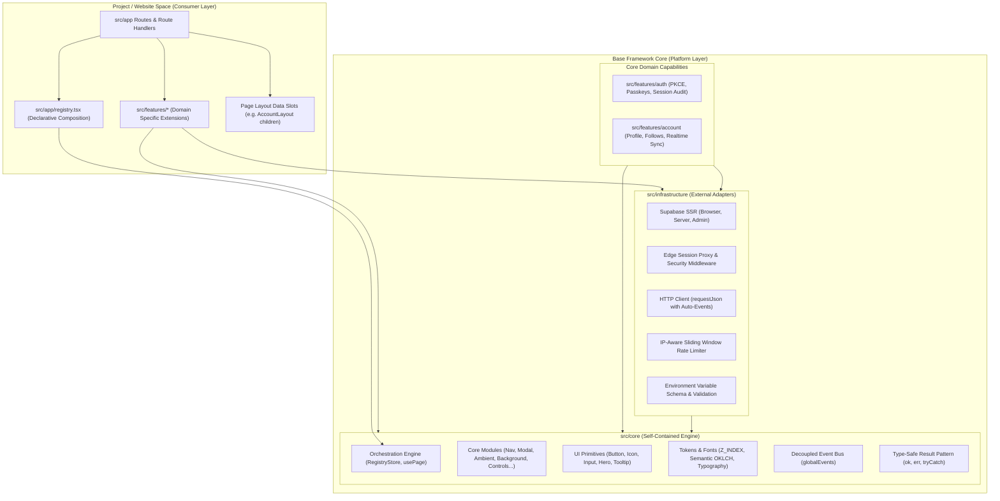

# Base Framework — Master Architecture & Knowledge System

> **Target Audience:** AI Agents & Senior Software Engineers  
> **System Scope:** Reusable Multi-Site Platform Architecture  
> **Repository Root:** `/Users/omerdlw/Documents/Base Framework`  
> **Primary Technology Stack:** Next.js 16 (App Router), React 19, Tailwind CSS v4, Motion (v13), Supabase SSR, Cloudflare Workers / OpenNext

---

## 1. Framework Mental Model

Base Framework is **not** a single, standalone web application. It is a **production-grade foundation architecture** engineered to host multiple unique web products without duplicating platform-level infrastructure.

---

## 2. Fast Navigation Pathways

Select your entry point based on your immediate task:

### Path A: AI Agent Pre-Flight & Implementation Path

_If you are an AI coding assistant tasked with adding or modifying code, follow this sequence:_

1. **Understand Rules & Constraints:** Read [`ai-agent-rules-and-anti-patterns.md`](./ai-agent-rules-and-anti-patterns.md) first. It contains 10 inviolable rules, strict file placement decision trees, and the anti-patterns catalog.
2. **Inspect Layer Boundaries:** Check [`architecture.md`](./architecture.md) to confirm what your target file is permitted to import.
3. **Choose the Right Workflow:** Follow [`development-workflows.md`](./development-workflows.md) for step-by-step blueprints on adding features, pages, or surfaces.
4. **Register with the Engine:** Read [`orchestration-and-registry.md`](./orchestration-and-registry.md) to wire your page/surface into the declarative orchestration engine.

### Path B: Developer Architecture Onboarding Path

_If you are a software engineer learning the codebase or building a new website on the framework:_

1. **Platform Foundations:** Read [`architecture.md`](./architecture.md) for the 4-layer separation of concerns and framework vs. website boundaries.
2. **Page & Chrome Model:** Read [`orchestration-and-registry.md`](./orchestration-and-registry.md) to understand how `usePage()` and the `RegistryStore` power page chrome, navigation cards, and backgrounds.
3. **Core Interactive Modules:** Read [`core-modules.md`](./core-modules.md) for detailed mechanics of the dock, task surfaces, modals, notifications, and background media.
4. **Data & Auth Plumbing:** Read [`infrastructure-and-data.md`](./infrastructure-and-data.md) and [`features-and-domain.md`](./features-and-domain.md) for the database schema, RLS policies, and server actions.
5. **Motion & Styling System:** Read [`motion-and-styling.md`](./motion-and-styling.md) for GPU transforms, Apple fluid timings, and Tailwind v4 token configurations.

---

## 3. Documentation System Index

| Document                                                                           | Key Topics Covered                                                                                                                                                                                                                                                                                                                                                                                                                                                                                                                                                                                                                                                                                                                                  |
| :--------------------------------------------------------------------------------- | :-------------------------------------------------------------------------------------------------------------------------------------------------------------------------------------------------------------------------------------------------------------------------------------------------------------------------------------------------------------------------------------------------------------------------------------------------------------------------------------------------------------------------------------------------------------------------------------------------------------------------------------------------------------------------------------------------------------------------------------------------- |
| **[`architecture.md`](./architecture.md)**                                         | • The 4-Layer Model (`core`, `infrastructure`, `features`, `app`) • Strict boundary enforcement (`eslint` + test assertions) • Framework vs. Website code boundary • Core architectural invariants & design decisions                                                                                                                                                                                                                                                                                                                                                                                                                                                                                                                      |
| **[`orchestration-and-registry.md`](./orchestration-and-registry.md)**             | • `RegistryStore` and registration lifecycle (`STATIC`, `DYNAMIC`, `USER`) • Dual-mode `usePage()` hook (Producer vs Consumer) • Priority resolution, scoping (`app`, `route`, `instance`), and diagnostics • Central app registry (`src/app/registry.tsx`)                                                                                                                                                                                                                                                                                                                                                                                                                                                                                |
| **[`core-modules.md`](./core-modules.md)**                                         | • Navigation Dock & 6-Phase Task Surface System (`src/core/modules/nav`) • Ambient dynamic theme palette extraction (`src/core/modules/ambient`) • Multi-media background engine with video/audio controls (`src/core/modules/background`) • Promise-based modal stack system (`src/core/modules/modal`) • Rate-limited, deduplicated notification/toast bus (`src/core/modules/notification`) • Screen-collision aware context menu resolver (`src/core/modules/context-menu`) • Dynamic viewport-tracked controls rails (`src/core/modules/controls`) • Three-tier error boundaries (`GlobalError`, `ModuleError`, `ComponentError`) • Anti-flicker loading overlay & skeleton state machine (`src/core/modules/loading`) |
| **[`features-and-domain.md`](./features-and-domain.md)**                           | • Feature anatomy and tri-part folder structure (`index.ts`, `client.ts`, `server/`) • Strict client/server separation (`"use client"` vs `"use server"` vs `import "server-only"`) • Auth feature: PKCE flow, Passkeys, session verification, `AuthListener` • Account feature: Profiles, `AccountLayout` slots, `AccountGuard` • Social feature: Follow relations, follow requests, unread notifications, realtime sync                                                                                                                                                                                                                                                                                                               |
| **[`infrastructure-and-data.md`](./infrastructure-and-data.md)**                   | • Supabase database schema (`accounts`, `account_emails`, `account_follows`, `auth_sessions`, `notifications`) • Row Level Security (RLS) policies and security triggers • Custom PostgreSQL RPC functions (`touch_auth_session`, `update_account`, etc.) • Supabase Client factory trio (`createBrowserSupabaseClient`, `createServerSupabaseClient`, `createAdminSupabaseClient`) • Edge proxy middleware (`src/proxy.ts`): session heartbeat and revocation enforcement • Unified HTTP client (`requestJson`) with event dispatching • Sliding-window rate limiter (`checkRateLimit`)                                                                                                                                          |
| **[`motion-and-styling.md`](./motion-and-styling.md)**                             | • GPU-accelerated motion architecture (`translate3d`, `contain: paint` avoidance, subpixel rounding) • Motion tokens & choreography timing synchronization (`NAV_SURFACE_CHOREOGRAPHY_TIMINGS`) • Tailwind CSS v4 `@theme` configuration with semantic OKLCH colors • Font variables (Geist Sans, Zuume Bold) • Strict Layering Contract (`Z_INDEX` tokens)                                                                                                                                                                                                                                                                                                                                                                             |
| **[`development-workflows.md`](./development-workflows.md)**                       | • Blueprint 1: Building a new website on the framework • Blueprint 2: Creating a new feature from scratch • Blueprint 3: Creating a new route with Server/Client component split • Blueprint 4: Creating a new Task Surface or Modal • Blueprint 5: Modifying an existing feature safely • Mandatory naming, import, and barrel export conventions • Verification commands (`npm test`, `npm run type-check`)                                                                                                                                                                                                                                                                                                                     |
| **[`git-workflow-guide.md`](./git-workflow-guide.md)**                             | • Basit ve Görsel Git Rehberi (Git bilmeyenler için araba fabrikası analojisi) • `origin` vs `upstream` iki uzak sunucu mantığı • 4 Temel Senaryo: Proje Kurma (Scaffold), Günlük Geliştirme, Güncelleme Alma (Sync), Upstream Katkı (Contrib) • Pre-commit bekçisi ve çakışma çözümleri                                                                                                                                                                                                                                                                                                                                                                                                                                                   |
| **[`ai-agent-rules-and-anti-patterns.md`](./ai-agent-rules-and-anti-patterns.md)** | • 10 Inviolable Architectural Rules • Where Does This Code Go? (Decision Tree) • Anti-Patterns Catalog ("DON'T DO THIS" vs "DO THIS") • Pre-Flight Checklist before committing code changes                                                                                                                                                                                                                                                                                                                                                                                                                                                                                                                                                |     |

---

## 4. Key Architectural Constants & Single Sources of Truth

When reading or modifying code, refer to these canonical modules:

- **Z-Index Layering:** [`src/core/tokens/tokens.ts`](file:///Users/omerdlw/Documents/Base%20Framework/src/core/tokens/tokens.ts#L1-L15)
- **Semantic Tone Classes:** [`src/core/tokens/tokens.ts`](file:///Users/omerdlw/Documents/Base%20Framework/src/core/tokens/tokens.ts#L17-L52)
- **Global Event Bus & Types:** [`src/core/events.ts`](file:///Users/omerdlw/Documents/Base%20Framework/src/core/events.ts#L97-L134)
- **Result Pattern:** [`src/core/result.ts`](file:///Users/omerdlw/Documents/Base%20Framework/src/core/result.ts#L1-L48)
- **Registry Types & Lifecycles:** [`src/core/orchestration/constants.ts`](file:///Users/omerdlw/Documents/Base%20Framework/src/core/orchestration/constants.ts#L10-L49)
- **Core Provider Hierarchy:** [`src/core/provider.tsx`](file:///Users/omerdlw/Documents/Base%20Framework/src/core/provider.tsx#L52-L86)
- **App Providers Composition:** [`src/app/providers.tsx`](file:///Users/omerdlw/Documents/Base%20Framework/src/app/providers.tsx#L20-L37)
- **Static App Route Registry:** [`src/app/registry.tsx`](file:///Users/omerdlw/Documents/Base%20Framework/src/app/registry.tsx#L13-L37)
- **Supabase Migration & Schema:** [`supabase/migrations/20260917000000_initial_schema.sql`](file:///Users/omerdlw/Documents/Base%20Framework/supabase/migrations/20260917000000_initial_schema.sql)
- **Architecture Tests:** [`tests/architecture.test.js`](file:///Users/omerdlw/Documents/Base%20Framework/tests/architecture.test.js#L6-L37)
