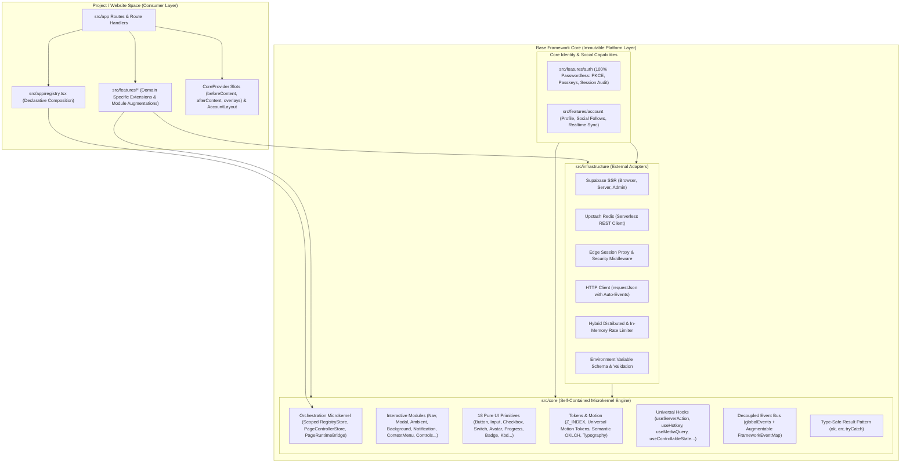

# Base Framework — Master Architecture & Knowledge System

> **Target Audience:** AI Agents & Senior Software Engineers  
> **System Scope:** Reusable Multi-Site Microkernel Platform Architecture  
> **Repository Root:** `/Users/omerdlw/Documents/Base Framework`  
> **Primary Technology Stack:** Next.js 16 (App Router), React 19, Tailwind CSS v4, Motion (v13), Supabase SSR, Cloudflare Workers / OpenNext

---

## 1. Framework Mental Model

Base Framework is **not** a single, standalone web application. It is a **production-grade Microkernel foundation architecture** engineered to host multiple unique web products without duplicating platform-level infrastructure or mutating core engine files.

---

## 2. Fast Navigation Pathways

Select your entry point based on your immediate task:

### Path A: AI Agent Pre-Flight & Implementation Path

_If you are an AI coding assistant tasked with adding or modifying code, follow this sequence:_

1. **Understand Rules & Constraints:** Read [`ai-agent-rules-and-anti-patterns.md`](./ai-agent-rules-and-anti-patterns.md) first. It contains 10 inviolable rules, strict file placement decision trees, and the anti-patterns catalog.
2. **Inspect Layer Boundaries:** Check [`architecture.md`](./architecture.md) to confirm what your target file is permitted to import.
3. **Choose the Right Workflow:** Follow [`development-workflows.md`](./development-workflows.md) for step-by-step blueprints on adding features, pages, task surfaces, or Microkernel extensions.
4. **Register with the Engine:** Read [`orchestration-and-registry.md`](./orchestration-and-registry.md) to wire your page/surface into `usePage()` or extend the registry via `defineRegistryModule()`.

### Path B: Developer Architecture Onboarding Path

_If you are a software engineer learning the codebase or building a new website on the framework:_

1. **Platform Foundations:** Read [`architecture.md`](./architecture.md) for the 4-layer separation of concerns, internal `src/core` acyclic hierarchy, and Immutable Core contract.
2. **Microkernel & Page Chrome:** Read [`orchestration-and-registry.md`](./orchestration-and-registry.md) to understand how `usePage()`, `PageRuntimeBridge`, and `RegistryStore` coordinate navigation cards, backgrounds, and custom feature modules.
3. **Modules, Primitives & Hooks:** Read [`core-modules.md`](./core-modules.md) for the 9 interactive modules, the catalog of 18 pure UI primitives, and universal hooks (`useServerAction`, `useHotkey`, `useMediaQuery`, `useControllableState`).
4. **Data & Auth Plumbing:** Read [`infrastructure-and-data.md`](./infrastructure-and-data.md) and [`features-and-domain.md`](./features-and-domain.md) for the database schema, RLS policies, and twin `auth`/`account` domains.
5. **Motion & Styling System:** Read [`motion-and-styling.md`](./motion-and-styling.md) for the two-tier motion token system (`src/core/tokens/motion.ts` & `src/core/modules/nav/motion.ts`), GPU transforms, and Tailwind v4 OKLCH palettes.

---

## 3. Documentation System Index

| Document                                                                           | Key Topics Covered                                                                                                                                                                                                                                                                                                                                                                                                                                                                                                                                                             |
| :--------------------------------------------------------------------------------- | :----------------------------------------------------------------------------------------------------------------------------------------------------------------------------------------------------------------------------------------------------------------------------------------------------------------------------------------------------------------------------------------------------------------------------------------------------------------------------------------------------------------------------------------------------------------------------- |
| **[`architecture.md`](./architecture.md)**                                         | • The 4-Layer Model (`core`, `infrastructure`, `features`, `app`) • Internal acyclic hierarchy of `src/core` • Automated boundary verification (`tests/architecture.test.js` & `tests/orchestration.test.js`) • Immutable Core contract & Open/Closed extension hierarchy                                                                                                                                                                                                                                                                                              |
| **[`orchestration-and-registry.md`](./orchestration-and-registry.md)**             | • Pure Microkernel architecture (`0` module imports in `src/core/orchestration`) • `PageRuntimeBridge` Inversion of Control & SSR-safe scoped `PageControllerStore` • Dual-mode `usePage()` hook (Producer vs Consumer) • Open/Closed extension APIs (`defineRegistryModule`, `registerPageResolver`, `createFeatureRegistrationHook`, `CoreProvider` `slots`/`overlays`, and `declare module` augmentation)                                                                                                                                                        |
| **[`core-modules.md`](./core-modules.md)**                                         | • 9 Interactive Platform Modules (`Nav` & 6-phase surfaces, `Ambient`, `Background`, `Modal`, `Notification` + `NotificationListener`, `ContextMenu`, `Controls`, `ErrorBoundary`, `Loading`) • **18 Pure UI Primitives Catalog** (`Button`, `Input`, `Textarea`, `Checkbox`, `Switch`, `Badge`, `Avatar`, `Progress`, `Separator`, `Skeleton`, `Kbd`, `Tooltip`, `Icon`, `Spinner`, `Loader`, `AdaptiveImage`, `BackdropHero`, `FullscreenState`) • **Universal Core Hooks** (`useServerAction` with `toast: true`, `useHotkey`, `useMediaQuery`, `useControllableState`) |
| **[`features-and-domain.md`](./features-and-domain.md)**                           | • Feature anatomy and tri-part folder structure (`index.ts`, `client.ts`, `server/`) • Strict client/server separation (`"use client"` vs `"use server"` vs `import "server-only"`) • Auth & Account twin architecture: PKCE flow, Passkeys, session audit, `AuthListener`, `AccountLayout`, `AccountGuard` • Social feature: Follow relations, follow requests, unread notifications, realtime sync                                                                                                                                                                  |
| **[`infrastructure-and-data.md`](./infrastructure-and-data.md)**                   | • Supabase database schema (`accounts`, `account_emails`, `account_follows`, `auth_sessions`, `notifications`) • Row Level Security (RLS) policies and PostgreSQL RPC functions • Supabase Client factory trio (`createBrowserSupabaseClient`, `createServerSupabaseClient`, `createAdminSupabaseClient`) • Upstash Redis REST adapter & hybrid distributed rate limiter (`checkRateLimitAsync`) • Edge proxy middleware (`src/proxy.ts`) & unified HTTP client (`requestJson`)                                                                                          |
| **[`motion-and-styling.md`](./motion-and-styling.md)**                             | • Two-Tier Motion Token Architecture: Universal tokens (`src/core/tokens/motion.ts`) + Nav Choreography (`src/core/modules/nav/motion.ts`) • GPU-accelerated compositor rules (`translate3d`, `scale`, integer pixel snapping) • Tailwind CSS v4 `@theme` configuration with semantic OKLCH colors • Strict Layering Contract (`Z_INDEX` tokens)                                                                                                                                                                                                                    |
| **[`development-workflows.md`](./development-workflows.md)**                       | • Blueprint 1: Building a new website on Base Framework • Blueprint 2: Creating a new feature from scratch • Blueprint 3: Creating a new Task Surface or Modal • Blueprint 4: Extending the Microkernel without modifying `src/core` • Multi-project lifecycle (`project:scaffold`, `project:validate`, `framework:sync`)                                                                                                                                                                                                                                            |
| **[`git-workflow-guide.md`](./git-workflow-guide.md)**                             | • Basit ve Görsel Git Rehberi (Git bilmeyenler için araba fabrikası analojisi) • `origin` vs `upstream` iki uzak sunucu mantığı • 4 Temel Senaryo: Proje Kurma (Scaffold), Günlük Geliştirme, Güncelleme Alma (Sync), Upstream Katkı (Contrib)                                                                                                                                                                                                                                                                                                                           |
| **[`ai-agent-rules-and-anti-patterns.md`](./ai-agent-rules-and-anti-patterns.md)** | • 10 Inviolable Architectural Rules • Where Does This Code Go? (Decision Tree) • Anti-Patterns Catalog ("DON'T DO THIS" vs "DO THIS") • Pre-Flight Checklist before committing code changes                                                                                                                                                                                                                                                                                                                                                                           |

---

## 4. Key Architectural Constants & Single Sources of Truth

- **Z-Index & Semantic Tones:** [`src/core/tokens/tokens.ts`](file:///Users/omerdlw/Documents/Base%20Framework/src/core/tokens/tokens.ts)
- **Universal Motion Tokens:** [`src/core/tokens/motion.ts`](file:///Users/omerdlw/Documents/Base%20Framework/src/core/tokens/motion.ts)
- **Nav & Surface Choreography Tokens:** [`src/core/modules/nav/motion.ts`](file:///Users/omerdlw/Documents/Base%20Framework/src/core/modules/nav/motion.ts)
- **Pure UI Primitives Barrel:** [`src/core/primitives/index.ts`](file:///Users/omerdlw/Documents/Base%20Framework/src/core/primitives/index.ts)
- **Universal Core Hooks:** [`src/core/hooks.ts`](file:///Users/omerdlw/Documents/Base%20Framework/src/core/hooks.ts)
- **Global Event Bus & Types:** [`src/core/events.ts`](file:///Users/omerdlw/Documents/Base%20Framework/src/core/events.ts)
- **Result Pattern:** [`src/core/result.ts`](file:///Users/omerdlw/Documents/Base%20Framework/src/core/result.ts)
- **Orchestration Microkernel Barrel:** [`src/core/orchestration/index.ts`](file:///Users/omerdlw/Documents/Base%20Framework/src/core/orchestration/index.ts)
- **Core Provider & Runtime Bridge:** [`src/core/provider.tsx`](file:///Users/omerdlw/Documents/Base%20Framework/src/core/provider.tsx)
- **Architecture & Microkernel Tests:** [`tests/architecture.test.js`](file:///Users/omerdlw/Documents/Base%20Framework/tests/architecture.test.js) & [`tests/orchestration.test.js`](file:///Users/omerdlw/Documents/Base%20Framework/tests/orchestration.test.js)
