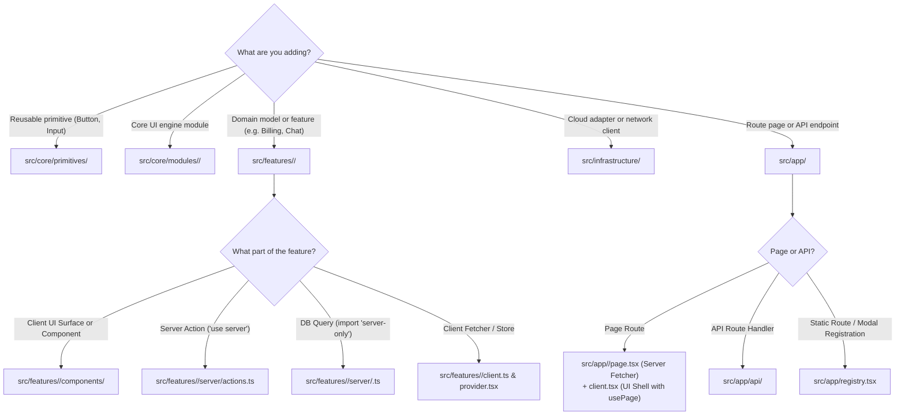

# AI Agent Rules, Anti-Patterns & Decision Trees

> **Crucial Notice for AI Coding Assistants:**  
> This document defines the strict operational boundaries, hard constraints, and prohibited patterns for any AI Agent reading, generating, or modifying code in Base Framework. Follow these rules without deviation.

---

## 1. The 10 Inviolable Architectural Rules

```mermaid
graph TD
  R1["1. Core Isolation\n(No @/features or @/app imports in core)"]
  R2["2. Feature Barrel Export\n(Mandatory index.ts per feature)"]
  R3["3. Server-Only Segregation\n(import 'server-only' on DB/secret files)"]
  R4["4. Motion Token Singularity\n(No inline animation durations or easings)"]
  R5["5. Z-Index Token Contract\n(Never use arbitrary z-50 or z-999)"]
  R6["6. Result Pattern Returns\n(Server Actions must return Result<T, E>)"]
  R7["7. Declarative Chrome\n(No hardcoded ad-hoc page headers or docks)"]
  R8["8. Event Bus Decoupling\n(Cross-feature communication via globalEvents)"]
  R9["9. Zero Direct Admin DB Access\n(createAdminSupabaseClient strictly for admin delete)"]
  R10["10. Verification Invariant\n(Must pass npm test & npm run type-check)"]
```



1. **Core & Microkernel Isolation Rule:**  
   `src/core` MUST NOT import from `@/features/**`, `@/app/**`, or `@/infrastructure/**`. Furthermore, `src/core/orchestration` MUST NOT import from `@/core/modules/**`. Running `npm test` enforces both invariants automatically.
2. **Feature Barrel Export Rule:**  
   Every folder in `src/features/` MUST contain an `index.ts` file that re-exports its public client API.
3. **Server-Only Segregation Rule:**  
   Any file querying the database directly, reading `SUPABASE_SECRET_KEY`, or managing cookies MUST include `import "server-only";` at line 1. NEVER re-export server files from `index.ts`.
4. **Motion Token Singularity Rule:**  
   NEVER write inline animation durations (e.g. `transition={{ duration: 0.3 }}`) or custom bezier curves inside components. Always import universal motion tokens from `@/core/tokens` (`DURATION_TOKENS`, `EASING_CURVES`, `SPRING_PRESETS`) or dock choreography tokens from `@/core/modules/nav/motion` (`NAV_SURFACE_BODY_ENTER_TRANSITION`, `NAV_TIERS`).
5. **Z-Index Token Contract:**  
   NEVER use arbitrary Tailwind utility classes like `z-50`, `z-[99]`, or `z-[9999]`. Always use `Z_INDEX` constants from `@/core/tokens`.
6. **Result Pattern Return Rule:**  
   Server Actions (`"use server"`) MUST NEVER throw unhandled errors across the network boundary. Return `Result<T, E>` using `ok(data)` and `err(message)` from `@/core/result`.
7. **Declarative Chrome Rule:**  
   NEVER build custom fixed `<header>`, `<nav>`, or dock bars on individual pages. Configure the framework dock using `usePage({ nav: { ... } })` or register routes in `src/app/registry.tsx`.
8. **Decoupled Realtime & Events Rule:**  
   Individual UI components MUST NOT create direct Supabase Realtime channel subscriptions. The realtime listener belongs in a centralized sync component (like `SocialRealtimeSync`), which emits `globalEvents`.
9. **RLS & Security Rule:**  
   NEVER use `createAdminSupabaseClient()` to bypass Row-Level Security for standard user mutations. Regular queries MUST use `createServerSupabaseClient()`.
10. **Pre-Completion Verification Rule:**  
    Before considering any task complete, you MUST execute `npm test` and `npm run type-check` to prove zero regressions.

---

## 2. Where Does This Code Go? (Decision Tree)



---

## 3. Anti-Patterns Catalog

### Anti-Pattern 1: Core Importing Feature Domain Code

❌ **DON'T DO THIS:**

```tsx
// Inside src/core/modules/nav/cards.tsx
import { useAccount } from "@/features/account"; // VIOLATION!
```

✅ **DO THIS:**

```tsx
// Core accepts domain data via props or registry adapters:
// Pass data from the feature into the core component:
<NavCardHeader title={account.displayName} icon={account.avatarUrl} />
```

---

### Anti-Pattern 2: Hardcoding Fixed Headers on Pages

❌ **DON'T DO THIS:**

```tsx
// Inside src/app/projects/client.tsx
export function ProjectsClient() {
  return (
    <div>
      {/* Handcrafted header breaking framework dock layout */}
      <header className="fixed top-0 left-0 right-0 h-16 bg-black z-50">
        <h1>Projects</h1>
      </header>
      ...
    </div>
  );
}
```

✅ **DO THIS:**

```tsx
// Inside src/app/projects/client.tsx
import { usePage } from "@/core/orchestration";

export function ProjectsClient() {
  usePage({
    nav: {
      title: "Projects",
      description: "Portfolio Showcases",
      icon: "solar:folder-with-files-bold",
    },
  });

  return <main className="relative z-10 min-h-screen p-8">...</main>;
}
```

---

### Anti-Pattern 3: Hardcoded Inline Animation Durations & Curves

❌ **DON'T DO THIS:**

```tsx
<motion.div
  initial={{ opacity: 0, y: 20 }}
  animate={{ opacity: 1, y: 0 }}
  transition={{ duration: 0.35, ease: "easeInOut" }} // VIOLATION!
/>
```

✅ **DO THIS:**

```tsx
import {
  NAV_SURFACE_BODY_ENTER_TRANSITION,
  navSurfaceBodyVariants,
} from "@/core/modules/nav/motion";

<motion.div
  variants={navSurfaceBodyVariants}
  initial="initial"
  animate="animate"
  exit="exit"
  transition={NAV_SURFACE_BODY_ENTER_TRANSITION}
/>;
```

---

### Anti-Pattern 4: Raw Throwing from Server Actions

❌ **DON'T DO THIS:**

```tsx
// Inside server/actions.ts
"use server";

export async function deleteItemAction(id: string) {
  if (!id) throw new Error("Invalid ID"); // Crashes transition unexpectedly
  await db.delete(id);
  return { deleted: true };
}
```

✅ **DO THIS:**

```tsx
// Inside server/actions.ts
"use server";

import { ok, err, type Result } from "@/core/result";

export async function deleteItemAction(
  id: string,
): Promise<Result<{ deleted: true }>> {
  if (!id) return err("Invalid ID");
  try {
    await db.delete(id);
    return ok({ deleted: true });
  } catch (error: any) {
    return err(error?.message || "Deletion failed");
  }
}
```

---

### Anti-Pattern 5: Arbitrary Z-Index Utility Classes

❌ **DON'T DO THIS:**

```tsx
<div className="fixed inset-0 z-50 bg-black/80">...</div> // Conflicts with Z_INDEX.NAV (100)
<div className="relative z-[999]">...</div>               // Breaks modal stacking
```

✅ **DO THIS:**

```tsx
import { Z_INDEX } from "@/core/tokens";

<div
  className="fixed inset-0 bg-black/80"
  style={{ zIndex: Z_INDEX.NAV_BACKDROP }}
>
  ...
</div>;
```

---

### Anti-Pattern 6: Re-Exporting Server-Only Code from `index.ts`

❌ **DON'T DO THIS:**

```typescript
// Inside src/features/account/index.ts
export * from "./server/profile"; // CRITICAL VIOLATION! Breaks client bundlers
```

✅ **DO THIS:**

```typescript
// Inside src/features/account/index.ts
// Export only client-safe utilities, types, components, and hooks
export * from "./types";
export * from "./constants";
export * from "./client";
export * from "./components/account-layout";

// Server callers import directly from:
// import { getPublicAccount } from "@/features/account/server";
```

---

### Anti-Pattern 7: Layout Reflow Animations

❌ **DON'T DO THIS:**

```tsx
// Animating height or top directly causes CPU layout reflow on every frame:
<motion.div animate={{ height: isOpen ? 400 : 0, top: isOpen ? 50 : 0 }} />
```

✅ **DO THIS:**

```tsx
// Animate scale and translate3d on the GPU compositor:
<motion.div animate={{ scaleY: isOpen ? 1 : 0, y: isOpen ? 0 : -20 }} />
```

---

## 4. Pre-Flight Verification Checklist for AI Agents

Before declaring any coding or refactoring task complete, execute the following commands in the terminal and verify they pass with exit code 0:

- [ ] **Architecture Test Check:** Run `npm test`  
      _Verifies that `src/core` has not imported from `@/features` and all features possess an `index.ts` barrel export._
- [ ] **TypeScript Type Check:** Run `npm run type-check`  
      _Verifies that all generics, Result types, and server/client boundaries compile cleanly with no type errors._
- [ ] **Lint Check:** Run `npm run lint`  
      _Verifies no-restricted-imports rules and React Hooks dependencies._
- [ ] **Format Check:** Run `npm run format:check`  
      _Verifies Prettier formatting compliance._
