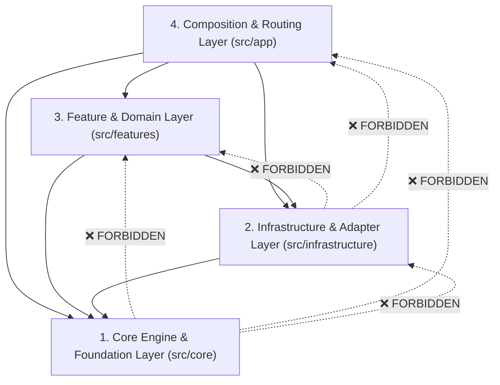
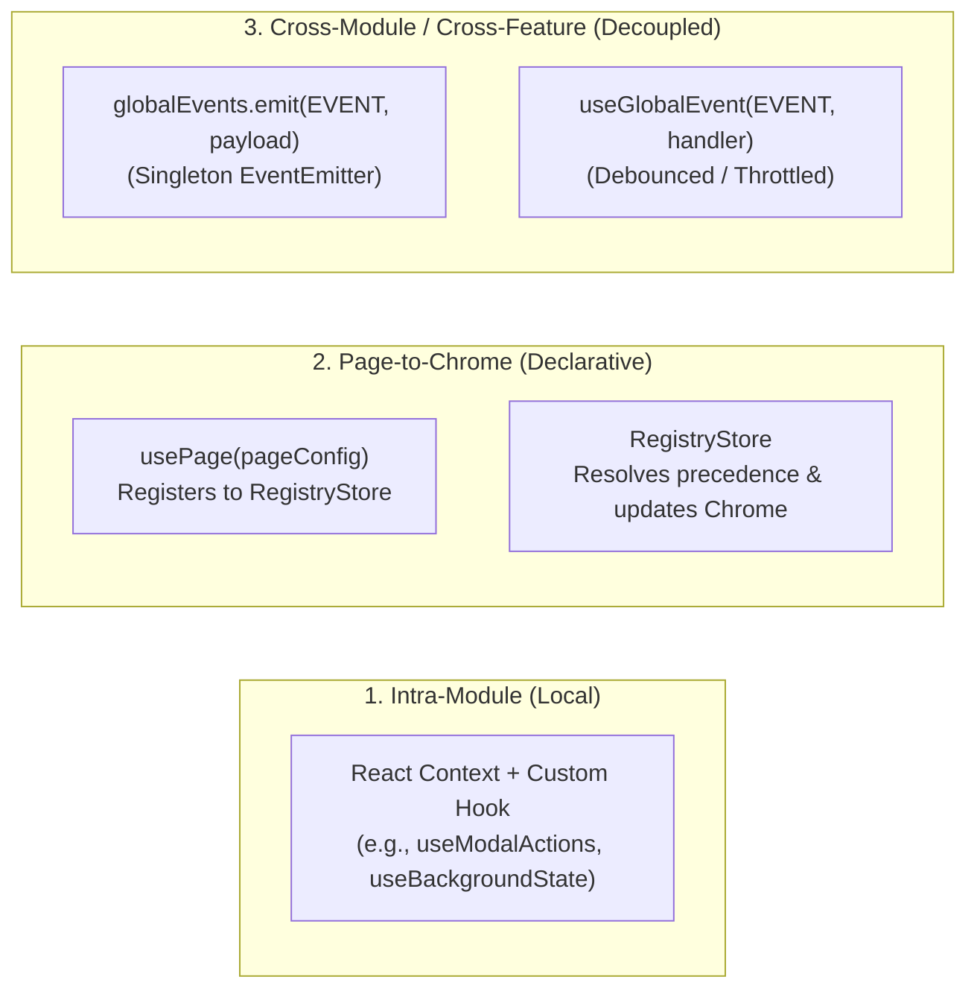

# Architecture & System Boundaries

Base Framework is architected around strict unidirectional dependencies, decoupled event-driven communication, declarative page-level orchestration, and explicit server-client execution boundaries.

---

## 1. The 4-Layer Architecture Model

The codebase is organized into four vertical layers with strictly enforced dependency rules:



### Layer 1: Core Engine (`src/core`)

- **Role:** The reusable, framework-grade engine. It has zero knowledge of application domains, specific websites, database tables, or authentication providers.
- **Contains:**
  - Orchestration engine (`src/core/orchestration`): Registry store, precedence resolver, controller lifecycle.
  - Interactive UI modules (`src/core/modules`): Nav dock, task surfaces, ambient theming, multi-layer background, modal stack, notifications, context menu, controls rails, error boundaries, loading overlay.
  - UI primitives (`src/core/primitives`): `Button`, `Icon`, `Input`, `AdaptiveImage`, `BackdropHero`, `Spinner`, `Tooltip`.
  - Tokens & constants (`src/core/tokens`): `Z_INDEX` layers, font loaders (`geistSans`, `zuume`), semantic OKLCH tone classes.
  - Decoupled Event Bus (`src/core/events.ts`): Singleton `EventEmitter` on `globalThis`.
  - Result Pattern (`src/core/result.ts`): `Result<T, E>`, `ok`, `err`, `tryCatch`.
  - Pure utilities & hooks (`src/core/utils.ts`, `src/core/hooks.ts`): Concurrent-safe hooks (`useEventState`, `useMounted`), debounce/throttle, string helpers.
- **Invariants:**
  - MUST NOT import from `@/features/**` (enforced by `tests/architecture.test.js` line 16 and `eslint.config.mjs` line 19).
  - MUST NOT import from `@/app/**` (enforced by `eslint.config.mjs` line 19).
  - MUST NOT import from `@/infrastructure/**`. Core is completely backend-agnostic.

### Layer 2: Infrastructure Adapters (`src/infrastructure`)

- **Role:** Adapters connecting the application to external systems, cloud services, and runtimes (Supabase, Cloudflare Workers, Edge Network, HTTP APIs).
- **Contains:**
  - Supabase SDK clients (`src/infrastructure/supabase`): Browser SSR client, server cookie client, admin service-role client, TypeScript database schema.
  - Edge Proxy & Session Middleware (`src/infrastructure/supabase/proxy.ts`, `src/proxy.ts`): Edge session touch, revoked session redirect, security response headers.
  - HTTP client (`src/infrastructure/http/client.ts`): `requestJson` wrapper that automatically parses errors and dispatches `API_UNAUTHORIZED` / `API_ERROR` events.
  - Security & Rate Limiting (`src/infrastructure/security/rate-limiter.ts`): In-memory sliding window rate limiter with Cloudflare IP header resolution.
  - Environment Config (`src/infrastructure/env.ts`): Environment variable validation (`requireSupabasePublicConfig`, `requireSupabaseSecretKey`).
- **Invariants:**
  - MUST NOT import from `@/features/**` or `@/app/**`.
  - MAY ONLY import pure utilities (`@/core/utils`) and event bus symbols (`@/core/events`).

### Layer 3: Feature Domains (`src/features`)

- **Role:** Business logic, domain data structures, server actions, and UI surfaces for specific capabilities (e.g., authentication, user accounts, social relationships).
- **Contains:**
  - `src/features/auth`: User authentication, session management, PKCE flow, WebAuthn/Passkeys, sign-in surfaces, verification surfaces, `AuthListener`.
  - `src/features/account`: User profile management, edit surface, setup surface, bio surface, `AccountLayout` template, `AccountGuard`.
  - `src/features/account/social`: Follow/unfollow relations, follow requests, inbox count, notification modal, Supabase Realtime channel bridge.
- **Invariants:**
  - Every feature folder MUST expose an `index.ts` barrel export (enforced by `tests/architecture.test.js` line 25).
  - Feature server code MUST live in `server.ts` or `server/` and enforce `import "server-only";`.
  - Feature server actions MUST reside in `actions.ts` or `server/actions.ts` marked with `"use server";`.
  - Feature client exports in `index.ts` must be safe for client bundles.

### Layer 4: Application & Composition (`src/app`)

- **Role:** The Next.js 16 App Router implementation that wires together the core engine, infrastructure adapters, and domain features into a functional web application.
- **Contains:**
  - Root layout & providers (`src/app/layout.tsx`, `src/app/providers.tsx`): Root HTML shell, fonts, `CoreProvider`, feature providers.
  - App Route Registry (`src/app/registry.tsx`): Declarative static navigation items and dynamic modal registrations.
  - Route pages (`src/app/page.tsx`, `src/app/account/[username]/page.tsx`): Server Components that fetch data and render client shells with page orchestration.
  - Route handlers (`src/app/api/**`): Next.js REST API endpoints with CSRF verification and rate limiting.
  - Global error, loading, robots, and sitemap handlers (`src/app/error.tsx`, `src/app/loading.tsx`, `src/app/robots.ts`, `src/app/sitemap.ts`).

---

## 2. Dependency Import Matrix

| Importer Layer           |              Can Import From `@/core`?               | Can Import From `@/infrastructure`? |       Can Import From `@/features`?        |      Can Import From `@/app`?       |
| :----------------------- | :--------------------------------------------------: | :---------------------------------: | :----------------------------------------: | :---------------------------------: |
| **`src/core`**           |                  ✅ Yes (internal)                   |            ❌ **NEVER**             | ❌ **FORBIDDEN (Enforced by test & lint)** | ❌ **FORBIDDEN (Enforced by lint)** |
| **`src/infrastructure`** | ⚠️ Restricted (`@/core/utils`, `@/core/events` only) |          ✅ Yes (internal)          |                ❌ **NEVER**                |            ❌ **NEVER**             |
| **`src/features`**       |                  ✅ Yes (`@/core`)                   |     ✅ Yes (`@/infrastructure`)     |  ⚠️ Yes (via barrel `@/features/<name>`)   |            ❌ **NEVER**             |
| **`src/app`**            |                  ✅ Yes (`@/core`)                   |     ✅ Yes (`@/infrastructure`)     |           ✅ Yes (`@/features`)            |          ✅ Yes (internal)          |

---

## 3. Boundary Enforcement Mechanisms

Architectural boundaries in Base Framework are not mere guidelines; they are actively verified in CI:

### 1. Test Suite Verification (`tests/architecture.test.js`)

- **Rule 1: Core isolation:** Scans all `.ts` and `.tsx` files in `src/core`. If any file contains an import matching `@/features`, the test suite fails immediately:
  ```javascript
  // tests/architecture.test.js:15-18
  assert.ok(
    !content.includes("@/features"),
    `Architecture violation: ${fullPath} imports from @/features`,
  );
  ```
- **Rule 2: Feature barrel exports:** Scans `src/features`. Every directory must contain an `index.ts`:
  ```javascript
  // tests/architecture.test.js:31-35
  const indexPath = path.join(featuresDir, feature, "index.ts");
  assert.ok(
    fs.existsSync(indexPath),
    `Feature '${feature}' is missing index.ts`,
  );
  ```

### 2. ESLint Static Analysis (`eslint.config.mjs`)

- Restricted imports rule prevents `src/core` from importing `@/app/**` or `@/features/**`:
  ```javascript
  // eslint.config.mjs:14-25
  "no-restricted-imports": [
    "error",
    {
      patterns: [
        {
          group: ["@/app/**", "@/features/**"],
          message: "Core cannot depend on app composition or feature domains.",
        },
      ],
    },
  ]
  ```

---

## 4. Framework vs. Website Code Boundary

To build multiple websites on Base Framework without code collisions, developers and AI Agents must respect the separation contract:

```
┌────────────────────────────────────────────────────────────────────────┐
│                        WEBSITE / APP CODE                              │
│  • src/app/registry.tsx          (Route tree, dock items, modals)      │
│  • src/app/**/page.tsx           (Page routes, metadata, data loading) │
│  • src/app/**/client.tsx         (Client page components with usePage) │
│  • src/app/globals.css           (Color overrides, brand theme tokens) │
│  • src/features/<custom-domain>  (Custom domain models, APIs, surfaces)│
│  • Data slots inside AccountLayout (custom posts, feeds, galleries)    │
└────────────────────────────────────────────────────────────────────────┘
                               ▲   Uses / Extends
                               │
┌────────────────────────────────────────────────────────────────────────┐
│                      BASE FRAMEWORK ENGINE                             │
│  • src/core/**                   (Orchestration, Dock, Modals, Ambient)│
│  • src/infrastructure/**         (Supabase SSR, Proxy, Rate Limiter)   │
│  • src/features/auth             (Identity, Sessions, Passkeys)        │
│  • src/features/account          (Profile data structures, layout base)│
│  • Root providers & Middleware   (CoreProvider, proxy.ts)              │
└────────────────────────────────────────────────────────────────────────┘
```

### What You DO Modify When Building a Website:

1. `src/app/registry.tsx`: Register your website routes, icons, descriptions, and custom modal components.
2. `src/app/`: Add new route folders with `page.tsx` (server fetcher) and `client.tsx` (UI shell with `usePage()`).
3. `src/features/<feature>/`: Add your domain capabilities (e.g. video player, checkout).

---

## 5. The Engine-Isolated Upstream Model & Immutable Core Contract

Base Framework is architected for building **10-20 distinct downstream websites** over years of production without falling into the "fork drift" trap.

### The Immutable Core Invariant

In any downstream project (e.g. `Tvizzie`), the `src/core/` directory is an **upstream-managed, immutable engine**:

- **Forbidden:** Never modify files in `src/core/` for project-specific quirks or styling.
- **Extension Hierarchy:**
  1. **Styling & Tokens (%80):** Override CSS variables in `src/app/globals.css` via Tailwind `@theme`.
  2. **View Composition (%15):** Replace card/view bodies via React props and child composition.
  3. **Platform Slots (%4):** Register custom dock actions, modal dialogues, or task surfaces in `src/app/registry.tsx`.
  4. **Engine Improvements (%1):** Genuine bugfixes or generic features belong in Base Framework. They are developed on a `contrib/*` branch and submitted upstream via PR.

### Repository Topography:

- **Base Framework (Upstream):** `git@github.com:your-org/base-framework.git`
- **Downstream Project (Origin):** `git@github.com:your-org/tvizzie.git`
- **Common Git History:** Downstream projects preserve the commit history of Base Framework, allowing Git's native 3-way merge to perform clean updates via `npm run framework:sync`.

3. `src/app/globals.css`: Tune `:root` CSS variables (`--primary`, `--black`, `--white`) or font definitions.
4. `src/features/`: Create new domain feature directories following the tri-part architecture (`index.ts`, `client.ts`, `server/`).
5. Account data section: Pass project-specific components into `<AccountLayout>{/* Your custom data */}</AccountLayout>`.

### What You DO NOT Modify Unless Patching the Platform:

1. `src/core/orchestration/**`: Do not alter the registry store, lifecycle policies, or priority resolvers.
2. `src/core/modules/**`: Do not alter the dock physics, surface phase transitions, or modal backdrop mechanics.
3. `src/core/provider.tsx`: Do not change the core provider nesting order.
4. `src/proxy.ts`: Do not remove edge session touching or security header injection.

---

## 5. Communication & Inter-Module Decoupling

Modules in Base Framework never directly touch internal states of other modules. Instead, three communication tiers exist:



1. **Intra-Module Communication:** Handled via React Context (`ModalContext`, `BackgroundStateContext`, `NavigationContext`). Used strictly within a single module boundary.
2. **Page-to-Chrome Communication:** Handled declaratively via `usePage({ nav, background, controls, loading, actions })`. Pages declare what chrome they want; the `RegistryStore` handles merging, priority, and transitions.
3. **Cross-Feature / Cross-Module Communication:** Handled via the global event bus (`src/core/events.ts`).
   - _Example:_ When `requestJson` receives a `401 Unauthorized`, it does not import `auth` or `nav`. It calls `globalEvents.emit(EVENT_TYPES.API_UNAUTHORIZED, payload)`. The `AuthListener` in `src/features/auth` subscribes to this event and commands the dock to open the Sign-In surface.

---

## 6. Type Safety & Error Modeling: The Result Pattern

Base Framework strictly discourages uncontrolled throwing across domain boundaries. In `src/core/result.ts`, the platform defines a discriminated union for all operations and Server Actions:

```typescript
export interface SuccessResult<T> {
  readonly code?: string;
  readonly data: T;
  readonly error?: never;
  readonly success: true;
}

export interface ErrorResult<E = string> {
  readonly code?: string;
  readonly data?: never;
  readonly error: E;
  readonly success: false;
}

export type Result<T, E = string> = SuccessResult<T> | ErrorResult<E>;
```

### Operational Helpers:

- `ok(data, code?)`: Constructs a type-safe `SuccessResult`.
- `err(error, code?)`: Constructs a type-safe `ErrorResult`.
- `tryCatch(promiseOrFn, mapError?)`: Executes an async operation without throwing, returning a `Result<T, E>`.

---

## 7. Client vs. Server Segregation Contract

Next.js 16 runs code across two distinct environments. Base Framework enforces the boundary with runtime guards:

1. **Server-Only Files:**
   - Files touching the database, secrets (`SUPABASE_SECRET_KEY`), or cookies MUST begin with:
     ```typescript
     import "server-only";
     ```
   - If any client component attempts to import this file, the build fails immediately.
2. **Server Actions:**
   - Files exporting Server Actions callable by forms or transitions MUST begin with:
     ```typescript
     "use server";
     ```
3. **Client Interactive Files:**
   - Files using hooks (`useState`, `useEffect`, `usePage`), animations (`motion`), or event listeners MUST begin with:
     ```typescript
     "use client";
     ```
