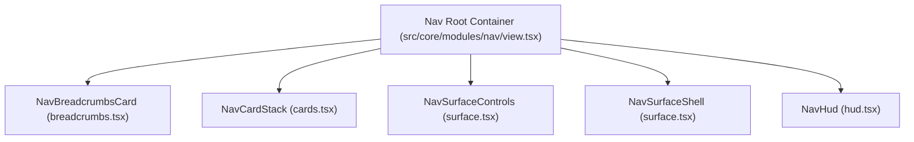
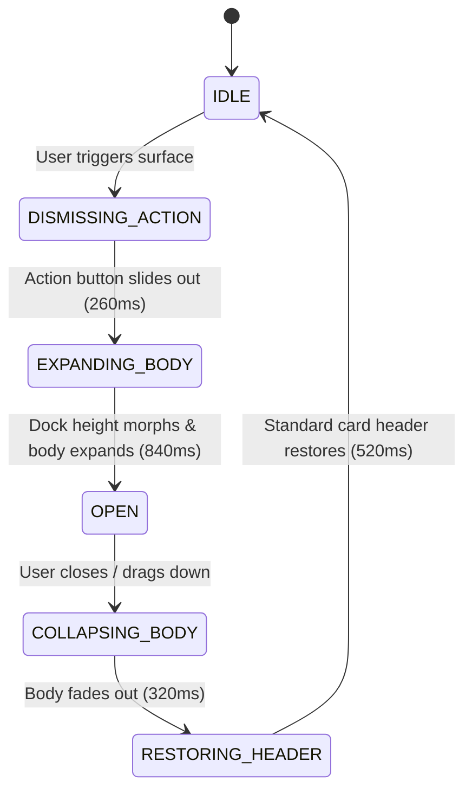

# Core Modules Architecture

All interactive platform modules reside under [`src/core/modules`](file:///Users/omerdlw/Documents/Base%20Framework/src/core/modules). Each module follows a standardized architectural pattern: dedicated React context, typed state machine, pure utility helpers, declarative builders, motion constants, and a top-level renderer portal.

---

## 1. Nav Module (`src/core/modules/nav`)

The Nav module is the primary navigation shell of Base Framework. It merges macOS Dock / iOS card stack ergonomics with deterministic JavaScript scheduling and Motion GPU hardware acceleration.



### 1.1 Card Stack Mechanics (`cards.tsx`)

- **Dock Hierarchy:** Cards stack in z-order with fractional depth scaling (`scale: 0.96 -> 1.0`) and vertical offsets calculated by `getNavItemAnimateValues`.
- **Hover Peek:** Hovering over the active card gently fans out underlying cards (`peek` mode) without causing DOM layout reflow.
- **Scroll-Driven Compact Mode:** As the viewport scrolls, `useNavViewport` compresses the dock into a sleek 38px pill. Underlying cards animate out with `getNavItemCompactExitValues`, and a compact title overlay fades in (`navCompactTitleVariants`).
- **Route Restoration:** Transitioning back from compact mode executes `NAV_COMPACT_STACK_EXIT_TRANSITION` (0.40s `APPLE_FLUID`).

### 1.2 The 6-Phase Task Surface System (`surface.tsx`)

Surfaces are dynamic, expanded modal panels that morph directly out of a navigation card to host complex workflows (e.g., Edit Account, Sign In, Settings, Media Player).



1. **`DISMISSING_ACTION` (Phase 1):** The card's action button slides up and exits (`NAV_ACTION_DISMISS_TRANSITION`, 260ms).
2. **`EXPANDING_BODY` (Phase 2):** The dock container expands its width and height (`NAV_CARD_HEIGHT_OPEN_TRANSITION`, 840ms). The surface body renders with slide and fade (`NAV_SURFACE_BODY_ENTER_TRANSITION`).
3. **`OPEN` (Phase 3):** Fully interactive state. Features can render multi-step wizards, tab bars, or extension shelves.
4. **`COLLAPSING_BODY` (Phase 4):** Surface body animates downward with GPU transform (`NAV_SURFACE_BODY_EXIT_TRANSITION`, 320ms).
5. **`RESTORING_HEADER` (Phase 5):** The original navigation card header blurs back into position (`NAV_HEADER_SWAP_TRANSITION`, 520ms).
6. **`IDLE` (Phase 6):** Surface scheduler cleans up state and releases DOM focus.

### 1.3 Surface Features & Handshakes

- **Drag-to-Dismiss:** Integrated spring physics (`NAV_SURFACE_DRAG_THRESHOLDS`, drag threshold: 140px, velocity threshold: 600px/s).
- **Focus Trapping:** Automatically traps Tab focus within the active surface (`useNavigationFocusTrap`) and restores focus to the invoking card upon close (`shouldRestoreNavigationFocus`).
- **Step Flows:** Supports wizard navigation via `createSurfaceFlowDefinition` and `createSurfaceFlowSession`.
- **Return Handshakes:** `createSurfaceReturnHandshake` allows returning typed results back to the caller upon surface closure.

### 1.4 Heads-Up Display (HUD) (`hud.tsx`)

An informational overlay that slots directly into the top card of the dock (`NAV_HUD_VARIANT`: `DEFAULT`, `MINIMAL`, `COMPACT`, `STATUS`). Used for long-running operations, playback status, or transient notifications.

---

## 2. Ambient Module (`src/core/modules/ambient`)

Dynamically extracts dominant palettes from images, video posters, or canvas streams and injects scoped or global CSS variables.

### How It Works:

1. `extractPaletteFromImage` loads the image onto an offscreen HTML5 `<canvas>`.
2. Analyzes color distributions, calculates luminance, and extracts:
   - `primary`: Dominant accent color.
   - `black`: Deepest background tone.
3. `useAmbientTheme` injects these colors into CSS custom properties:
   - `--primary`
   - `--black`
4. Adds smooth CSS transition classes (`transition-colors duration-700 ease-out`) to prevent jarring visual jumps.

### Usage in Components:

```tsx
import { useAmbientTheme } from "@/core/modules/ambient";

export function AlbumView({ coverUrl }: { coverUrl: string }) {
  useAmbientTheme({
    image: coverUrl,
    tintGlobals: true, // Injects into document :root
    transition: true,
  });

  return <div>...</div>;
}
```

---

## 3. Background Module (`src/core/modules/background`)

Provides a high-performance, multi-layered visual canvas behind all website content (`z-index: 0`).

### Layer Composition:

1. **Color Layer:** Solid hex or OKLCH background.
2. **Gradient Layer:** Linear / radial CSS gradients.
3. **Media Layer:** Responsive video `<video>` or adaptive image ``.
4. **Edge Fades:** Linear gradient masks fading top, bottom, left, or right edges (`fadeEdges`).
5. **Noise Layer:** Film grain SVG noise overlay with configurable opacity.
6. **Scrim Overlay:** Darkening overlay with adjustable opacity.

### Transport API (`useBackgroundActions`):

```tsx
const {
  setBackground,
  setVideoPlaying,
  toggleVideo,
  toggleMute,
  setVideoMuted,
  resetBackground,
} = useBackgroundActions();
```

- **Auto-Reset:** Automatically resets to `DEFAULT_BACKGROUND` upon route changes unless a new background is registered by the incoming route via `usePage({ background })`.

---

## 4. Modal Module (`src/core/modules/modal`)

A Promise-based modal stack manager supporting stacked layers, responsive position morphing, and lazy SSR-safe rendering.

### Key Capabilities:

- **Promise-Based Return:** Calling `openModal()` returns a Promise that resolves when the user dismisses the modal or submits data:
  ```tsx
  const modal = useModal();
  const result = await modal.openModal("CONFIRM_ACTION", {
    title: "Delete Account",
    data: { id: "123" },
  });
  if (result?.confirmed) {
    // execute
  }
  ```
- **Modal Stack:** Multiple modals can open on top of each other. Closing the top modal reveals the previous one without unmounting the stack.
- **Positions (`MODAL_POSITIONS`):** `CENTER`, `TOP`, `BOTTOM`, `SHEET`, `FULL`, `RESPONSIVE` (e.g. sheet on mobile, center dialog on desktop).
- **Chrome Variants (`MODAL_CHROME`):** `PANEL` (standard card), `MINIMAL` (no frame), `SHEET` (bottom slide-up).

---

## 5. Notification Module (`src/core/modules/notification`)

A centralized, non-blocking toast messaging system rendered at `Z_INDEX.NOTIFICATION` (110).

### Features:

- **Anti-Flood & Deduplication:** Toasts with identical `dedupeKey` or identical content within a short interval are merged rather than stacked.
- **Duration Tiers (`TOAST_DURATIONS`):**
  - `SHORT`: 2500ms (info, confirmations).
  - `DEFAULT`: 4500ms (standard messages, warnings).
  - `LONG`: 7000ms (critical errors).
  - `PERSISTENT`: Stays until explicitly dismissed.
- **API (`useToast`):**
  ```tsx
  const toast = useToast();
  toast.success("Profile saved");
  toast.error("Network connection lost", { duration: 7000 });
  toast.warning("Unsaved changes", {
    action: { label: "Save", onClick: handleSave },
  });
  ```

---

## 6. Context Menu Module (`src/core/modules/context-menu`)

A global right-click menu system that replaces default browser menus with theme-aware, accessible action lists.

### Architecture:

- **DOM Target Matching:** When a pointer `contextmenu` event occurs, `src/core/modules/context-menu/resolver.ts` walks the DOM tree upward to match selectors or data attributes registered in the registry.
- **Collision Detection:** Measures menu bounding box against viewport dimensions. Automatically flips horizontal and vertical alignment to prevent clipping off-screen.
- **Declarative Registration:** Pages register context menus via `usePage({ contextMenu })` or statically in `APP_REGISTRY_ENTRIES`.

---

## 7. Controls Module (`src/core/modules/controls`)

Manages floating action buttons and toolbars on the left and right rails of the screen (`Z_INDEX.NAV`: 100), positioned symmetrically beside the dock.

### Viewport Sync via `ResizeObserver`:

- Controls never overlap the Navigation dock.
- `useControlsLayout` attaches a `ResizeObserver` to the `#nav-card-stack` DOM element and observes screen resizes, automatically aligning controls to the dock's exact vertical bottom and horizontal safe boundaries.

---

## 8. Error Boundary Module (`src/core/modules/error-boundary`)

A three-tier React error boundary hierarchy preventing catastrophic application crashes:

```
┌─────────────────────────────────────────────────────────────┐
│ 1. GlobalError (src/app/layout.tsx / src/core/provider.tsx) │
│    • Catches unhandled root crashes.                        │
│    • Resets on pathname change (resetKey = pathname).       │
└──────────────────────────────┬──────────────────────────────┘
                               │
┌──────────────────────────────▼──────────────────────────────┐
│ 2. ModuleError (Wraps individual core modules)              │
│    • Isolates module crashes (e.g. Nav or Ambient failure). │
│    • Allows remaining modules and page content to function. │
└──────────────────────────────┬──────────────────────────────┘
                               │
┌──────────────────────────────▼──────────────────────────────┐
│ 3. ComponentError (Inline widget boundary)                  │
│    • Renders localized fallback for specific cards/widgets. │
└─────────────────────────────────────────────────────────────┘
```

- **Event Bus Emission:** On error, emits `EVENT_TYPES.APP_ERROR` on `globalEvents`.
- **Telemetry Hook:** Integrates with `getErrorReporter()` for logging to external observability services.

---

## 9. Loading Module (`src/core/modules/loading`)

Coordinates global loading indicators, blocking backdrops, and skeleton placeholders.

### Anti-Flicker State Machine:

- When an async operation completes in under 150ms, showing a loading spinner causes an annoying, jarring visual flicker.
- `LoadingProvider` enforces `minDuration`: If loading starts, it remains visible for a minimum guaranteed duration (default: 300ms) before transitioning out smoothly.
- **Skeleton Integration:** Supports typed skeleton schemas via `setSkeleton(skeletonValue)` allowing seamless transitions from skeleton geometry to live data.
