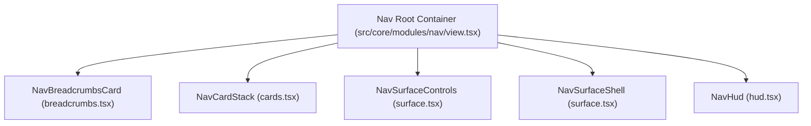
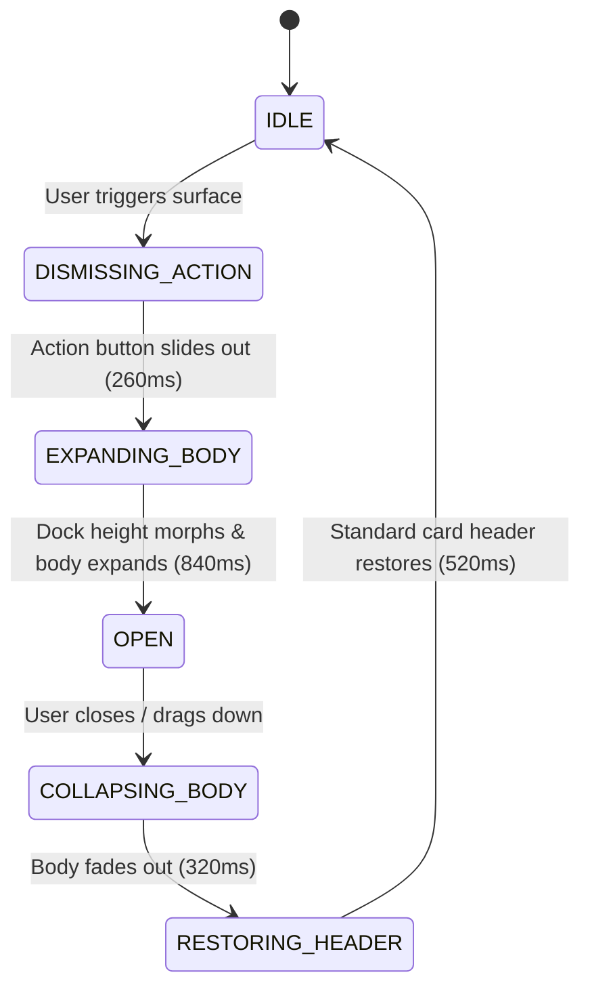

# Core Modules, Pure Primitives & Universal Hooks

All interactive platform modules reside under [`src/core/modules`](file:///Users/omerdlw/Documents/Base%20Framework/src/core/modules), atomic UI building blocks live in [`src/core/primitives`](file:///Users/omerdlw/Documents/Base%20Framework/src/core/primitives), and universal React hooks reside in [`src/core/hooks.ts`](file:///Users/omerdlw/Documents/Base%20Framework/src/core/hooks.ts). Together they form a complete, self-contained application shell with zero domain coupling.

---

## 1. Nav Module (`src/core/modules/nav`)

The Nav module is the primary navigation and workflow shell of Base Framework. It merges macOS Dock and iOS card stack ergonomics with deterministic JavaScript scheduling and Motion GPU hardware acceleration.



### 1.1 Card Stack Mechanics (`cards.tsx`)

- **Dock Hierarchy:** Cards stack in z-order with fractional depth scaling (`scale: 0.96 -> 1.0`) and integer-rounded vertical offsets calculated by `getNavItemAnimateValues`.
- **Hover Peek:** Hovering over the active card gently fans out underlying cards (`peek` mode) using GPU transforms (`translate3d`, `scale`) without triggering DOM layout reflow.
- **Scroll-Driven Compact Mode:** As the viewport scrolls down, `useNavViewport` compresses the dock into a sleek 38px pill. Underlying cards animate out with `getNavItemCompactExitValues`, and a compact title overlay fades in (`navCompactTitleVariants`).
- **Route Restoration:** Transitioning back from compact mode executes `NAV_COMPACT_STACK_EXIT_TRANSITION` (`0.40s` `FLUID`).

### 1.2 The 6-Phase Task Surface System (`surface.tsx`)

Surfaces are dynamic, expanded modal panels that morph directly out of a navigation card to host multi-step workflows (e.g., Edit Profile, Passwordless Sign-In, Settings, Media Player).



1. **`DISMISSING_ACTION` (Phase 1):** The card's action button slides up and exits (`NAV_ACTION_DISMISS_TRANSITION`, `260ms`).
2. **`EXPANDING_BODY` (Phase 2):** The dock container expands its dimensions (`NAV_CARD_HEIGHT_OPEN_TRANSITION`, `840ms`). The surface body enters with slide and fade (`NAV_SURFACE_BODY_ENTER_TRANSITION`).
3. **`OPEN` (Phase 3):** Fully interactive state supporting wizard flows, tab bars, and extension shelves.
4. **`COLLAPSING_BODY` (Phase 4):** Surface body animates downward on the GPU compositor (`NAV_SURFACE_BODY_EXIT_TRANSITION`, `320ms`).
5. **`RESTORING_HEADER` (Phase 5):** The original navigation card header swaps back into place (`NAV_HEADER_SWAP_TRANSITION`, `520ms`).
6. **`IDLE` (Phase 6):** Surface scheduler cleans up state and restores DOM focus to the invoking trigger.

### 1.3 Surface Features & Return Handshakes

- **Drag-to-Dismiss:** Integrated spring physics (`NAV_SURFACE_DRAG_THRESHOLDS`, drag distance `140px`, velocity `600px/s`).
- **Focus Trapping:** Automatically traps `Tab` / `Shift+Tab` focus inside the open surface (`useNavigationFocusTrap`) and restores focus on close.
- **Step Flows & Return Handshakes:** Supports multi-step wizard flows (`createSurfaceFlowDefinition`, `createSurfaceFlowSession`) and typed Promise return payloads (`createSurfaceReturnHandshake`).

### 1.4 Heads-Up Display (HUD) (`hud.tsx`)

An informational overlay that slots directly into the top card of the dock (`NAV_HUD_VARIANT`: `DEFAULT`, `MINIMAL`, `COMPACT`, `STATUS`) for live background operations, playback states, or transient progress feedback.

---

## 2. Ambient Module (`src/core/modules/ambient`)

Dynamically extracts dominant color palettes from images, video posters, or canvas frames and injects scoped or global CSS variables.

1. `extractPaletteFromImage` draws the target asset onto an offscreen HTML5 `<canvas>`.
2. Samples luminance and chroma distributions to compute:
   - `primary`: Dominant accent tone.
   - `black`: Deepest atmospheric background tone.
3. `useAmbientTheme` updates `--primary` and `--black` on `:root` (or a scoped container) with smooth `duration-700` color transitions.

---

## 3. Background Module (`src/core/modules/background`)

Provides a multi-layered visual canvas behind all website content (`Z_INDEX.BACKGROUND = 0`):

1. **Color & Gradient Layers:** Solid OKLCH/hex base and radial/linear CSS gradients.
2. **Media Layer:** Responsive `<video>` loop or `<AdaptiveImage>` with playback and mute controls (`useBackgroundActions`).
3. **Edge Fades (`fadeEdges`):** Configurable gradient masks softening top, bottom, left, or right boundaries.
4. **Noise & Scrim Layers:** Subtle film-grain SVG overlay and darkening backdrop scrim.

---

## 4. Modal Module (`src/core/modules/modal`)

A Promise-based modal stack manager supporting stacked layers, responsive position morphing, and lazy SSR-safe rendering at `Z_INDEX.MODAL = 100`.

```tsx
const modal = useModal();
const result = await modal.openModal("CONFIRM_ACTION", "center", {
  data: { id: "123" },
});
if (result?.confirmed) {
  // User confirmed
}
```

- **Positions (`MODAL_POSITIONS`):** `CENTER`, `TOP`, `BOTTOM`, `SHEET`, `FULL`, `RESPONSIVE` (bottom sheet on mobile, centered dialog on desktop).
- **Chrome Variants (`MODAL_CHROME`):** `PANEL`, `MINIMAL`, `SHEET`.

---

## 5. Notification Module (`src/core/modules/notification`)

A centralized, non-blocking toast messaging system rendered at `Z_INDEX.NOTIFICATION = 110`.

- **Anti-Flood Deduplication:** Identical `dedupeKey` or duplicate messages within a short window are merged instead of flooding the screen.
- **Global Event Bus Bridge (`NotificationListener`):** Automatically listens to `EVENT_TYPES.UI_NOTIFICATION` on `globalEvents`. This enables non-React modules, HTTP interceptors, and hooks like `useServerAction(..., { toast: true })` to trigger toast alerts without importing the Notification React context directly.
- **Duration Tiers (`TOAST_DURATIONS`):** `SHORT` (`2500ms`), `DEFAULT` (`4500ms`), `LONG` (`7000ms`), `PERSISTENT`.

---

## 6. Context Menu Module (`src/core/modules/context-menu`)

A global right-click menu engine that replaces browser context menus with theme-aware action lists.

- **DOM Tree Resolution:** Walks upward from `event.target` to match selectors or `data-context-menu` attributes registered via `usePage({ contextMenu })` or `APP_REGISTRY_ENTRIES`.
- **Viewport Collision Detection:** Automatically flips horizontal and vertical menu opening directions when near screen edges.

---

## 7. Controls Module (`src/core/modules/controls`)

Manages floating action buttons and toolbars on the left and right rails of the screen (`Z_INDEX.NAV = 100`), positioned symmetrically beside the Navigation dock. `useControlsLayout` attaches a `ResizeObserver` to `#nav-card-stack` so side controls never collide with the dock.

---

## 8. Error Boundary Module (`src/core/modules/error-boundary`)

A three-tier React error boundary hierarchy (`GlobalError` → `ModuleError` → `ComponentError`) that isolates failures so a crash in an individual widget or chrome module never takes down the entire page. Emits `EVENT_TYPES.APP_ERROR` on `globalEvents` and forwards diagnostics to `getErrorReporter()`.

---

## 9. Loading Module (`src/core/modules/loading`)

Coordinates global loading overlays and skeleton transitions at `Z_INDEX.LOADING = 150`. Enforces a minimum display window (`minDuration: 300ms`) so fast async calls never cause sub-150ms spinner flicker.

---

## 10. Pure UI Primitives Catalog (`src/core/primitives`)

Base Framework includes **18 pure, unopinionated UI primitives** exported from [`src/core/primitives/index.ts`](file:///Users/omerdlw/Documents/Base%20Framework/src/core/primitives/index.ts).

### The Pure Primitive Invariant

1. **Zero Domain Knowledge:** Primitives never import from `@/features/**`, `@/app/**`, or `@/infrastructure/**`.
2. **No Hardcoded Opinionated Variants:** Primitives do not hardcode brand variant strings (`"primary"`, `"secondary"`, `"danger"`). Instead, every primitive exposes structural `classNames` slots resolved via `resolveSlotClasses(defaultSlotClasses, classNames)` and `cn()`, giving downstream projects 100% styling freedom.
3. **Motion Token Compliance:** Animated primitives consume universal tokens from [`src/core/tokens/motion.ts`](file:///Users/omerdlw/Documents/Base%20Framework/src/core/tokens/motion.ts).

### Complete Primitives Reference

| Primitive           | File                                                                                                       | Key Slots (`classNames`)                                        | Description & Accessibility                                                                                      |
| :------------------ | :--------------------------------------------------------------------------------------------------------- | :-------------------------------------------------------------- | :--------------------------------------------------------------------------------------------------------------- |
| **`Button`**        | [`button.tsx`](file:///Users/omerdlw/Documents/Base%20Framework/src/core/primitives/button.tsx)            | `root`, `icon`, `label`, `spinner`                              | Polymorphic button/anchor with loading state, icon placement, and GPU tap feedback (`TAP_SCALE_SUBTLE`).         |
| **`Input`**         | [`input.tsx`](file:///Users/omerdlw/Documents/Base%20Framework/src/core/primitives/input.tsx)              | `wrapper`, `input`, `leftAddon`, `rightAddon`, `clearButton`    | Accessible text input with left/right icon addons and optional one-click clear button.                           |
| **`Textarea`**      | [`textarea.tsx`](file:///Users/omerdlw/Documents/Base%20Framework/src/core/primitives/textarea.tsx)        | `wrapper`, `textarea`, `footer`                                 | Multi-line input with optional auto-grow height calculation and character counter slot.                          |
| **`Checkbox`**      | [`checkbox.tsx`](file:///Users/omerdlw/Documents/Base%20Framework/src/core/primitives/checkbox.tsx)        | `root`, `box`, `indicator`, `label`, `description`              | WAI-ARIA `role="checkbox"` supporting controlled/uncontrolled `checked` and `"indeterminate"` states.            |
| **`Switch`**        | [`switch.tsx`](file:///Users/omerdlw/Documents/Base%20Framework/src/core/primitives/switch.tsx)            | `root`, `track`, `thumb`, `label`                               | Accessible `role="switch"` toggle with smooth hardware-composited thumb translation.                             |
| **`Badge`**         | [`badge.tsx`](file:///Users/omerdlw/Documents/Base%20Framework/src/core/primitives/badge.tsx)              | `root`, `dot`, `icon`, `content`                                | Compact status pill supporting status dots, leading icons, and semantic OKLCH tone composition.                  |
| **`Avatar`**        | [`avatar.tsx`](file:///Users/omerdlw/Documents/Base%20Framework/src/core/primitives/avatar.tsx)            | `root`, `image`, `fallback`, `status`                           | Resilient user/entity avatar with automatic initials calculation (`getAvatarInitials`), image fallback & status. |
| **`Progress`**      | [`progress.tsx`](file:///Users/omerdlw/Documents/Base%20Framework/src/core/primitives/progress.tsx)        | `root`, `header`, `label`, `valueText`, `track`, `indicator`    | Determinate (`0–100%` via `scaleX`) and indeterminate (`role="progressbar"`) GPU-accelerated progress bar.       |
| **`Separator`**     | [`separator.tsx`](file:///Users/omerdlw/Documents/Base%20Framework/src/core/primitives/separator.tsx)      | `root`, `line`, `label`                                         | Horizontal or vertical structural divider (`role="separator"`) with optional centered label.                     |
| **`Skeleton`**      | [`skeleton.tsx`](file:///Users/omerdlw/Documents/Base%20Framework/src/core/primitives/skeleton.tsx)        | `root`                                                          | Hardware-composited `.skeleton-block` placeholder supporting single blocks or multi-line text stacks.            |
| **`Kbd`**           | [`kbd.tsx`](file:///Users/omerdlw/Documents/Base%20Framework/src/core/primitives/kbd.tsx)                  | `root`, `key`, `separator`                                      | Semantic `<kbd>` keyboard shortcut display (e.g. `<Kbd keys={["⌘", "K"]} />`).                                   |
| **`Tooltip`**       | [`tooltip.tsx`](file:///Users/omerdlw/Documents/Base%20Framework/src/core/primitives/tooltip.tsx)          | `trigger`, `content`                                            | Portal-rendered hover/focus tooltip positioned at `Z_INDEX.TOOLTIP` (`250`) with collision awareness.            |
| **`Icon`**          | [`icon.tsx`](file:///Users/omerdlw/Documents/Base%20Framework/src/core/primitives/icon.tsx)                | `root`                                                          | Unified wrapper around `@iconify-icon/react` (`solar:*` icon set) with consistent optical sizing.                |
| **`Spinner`**       | [`spinner.tsx`](file:///Users/omerdlw/Documents/Base%20Framework/src/core/primitives/spinner.tsx)          | `root`, `track`, `indicator`                                    | Lightweight SVG activity indicator with configurable size and stroke width.                                      |
| **`Loader`**        | [`loader.tsx`](file:///Users/omerdlw/Documents/Base%20Framework/src/core/primitives/loader.tsx)            | `root`, `spinner`, `label`                                      | Centered loading state container pairing `Spinner` with descriptive status copy.                                 |
| **`AdaptiveImage`** | [`adaptive-image.tsx`](file:///Users/omerdlw/Documents/Base%20Framework/src/core/primitives/adaptive-image.tsx) | `wrapper`, `image`, `skeleton`, `fallback`                 | Next.js `<Image>` wrapper with smooth skeleton fade-in and error fallback handling.                              |
| **`BackdropHero`**  | [`backdrop-hero.tsx`](file:///Users/omerdlw/Documents/Base%20Framework/src/core/primitives/backdrop-hero.tsx) | `root`, `media`, `overlay`, `content`                      | Full-bleed atmospheric banner container with edge vignette gradients.                                            |
| **`FullscreenState`**| [`fullscreen-state.tsx`](file:///Users/omerdlw/Documents/Base%20Framework/src/core/primitives/fullscreen-state.tsx) | `root`, `icon`, `title`, `description`, `actions` | Standardized empty, offline, unauthorized, or error full-bleed state template.                                   |
| **`Select`**        | [`select.tsx`](file:///Users/omerdlw/Documents/Base%20Framework/src/core/primitives/select.tsx)       | `root`, `trigger`, `value`, `icon`, `listbox`, `option`, `optionLabel`, `optionDescription`, `optionCheck` | Accessible WAI-ARIA `combobox`/`listbox` select control with full keyboard navigation (`ArrowUp`/`Down`, `Home`/`End`, `Escape`), controlled/uncontrolled state, and `Z_INDEX.SELECT` elevation. |

---

## 11. Universal Core Hooks (`src/core/hooks.ts`) & Safe Actions (`src/core/result.ts`)

[`src/core/hooks.ts`](file:///Users/omerdlw/Documents/Base%20Framework/src/core/hooks.ts) and [`src/core/result.ts`](file:///Users/omerdlw/Documents/Base%20Framework/src/core/result.ts) provide concurrent-safe, SSR-compatible hooks and Server Action wrappers:

| Hook / Utility             | Signature / Capability                                                                                                                                                                                             |
| :------------------------- | :----------------------------------------------------------------------------------------------------------------------------------------------------------------------------------------------------------------- |
| **`createSafeAction`**     | `createSafeAction(handler, { schema, validate, mapError, errorCode })` — Wraps a `"use server"` function with optional input validation (`safeParse` or custom validator), automatic `try/catch` conversion to `Result<T, E>`, and `ok()` wrapping. |
| **`useServerAction`**      | `useServerAction(actionFn, { onSuccess, onError, successMessage, toast: true })` — Executes a `"use server"` action returning `Result<T, E>`. When `toast: true` is set, automatically dispatches error/success toasts via `EVENT_TYPES.UI_NOTIFICATION`. |
| **`useAsyncAction`**       | `useAsyncAction(asyncFn, { toast: true, errorMessage, successMessage })` — Wraps any Promise-returning client function with `{ execute, isPending, error }` and optional auto-toasting.                           |
| **`useStorageState`**      | `useStorageState(key, initialValue, { storage: "local" \| "session" })` — SSR-safe persistent state hook (`useLocalStorage` & `useSessionStorage` aliases included) with cross-tab `storage` event synchronization. |
| **`useIntersectionObserver`** | `useIntersectionObserver(ref, { threshold, rootMargin, freezeOnceVisible })` — Reactive viewport intersection observer returning `{ entry, isIntersecting }` for infinite scroll and scroll-triggered reveals.    |
| **`useControllableState`** | `useControllableState({ value, defaultValue, onChange })` — Seamlessly powers components that can operate in either controlled or uncontrolled React modes.                                                        |
| **`useMediaQuery`**        | `useMediaQuery("(min-width: 768px)")` — SSR-safe reactive CSS media query observer powered by `useSyncExternalStore`.                                                                                              |
| **`useHotkey`**            | `useHotkey("mod+k", handler, { preventDefault: true })` — Declarative keyboard shortcut listener (`mod`, `ctrl`, `meta`, `alt`, `shift`) that automatically ignores typing inside `<input>`, `<textarea>`, or `contentEditable` unless `enableOnFormTags: true` is set. |
| **`useGlobalEvent`**       | `useGlobalEvent(event, handler, { debounceMs, throttleMs })` — Subscribes to `globalEvents` with strongly-typed payload inference from `FrameworkEventMap`.                                                        |
| **`useEventState`**        | `useEventState(event, initialValue, reducer)` — Subscribes to event bus state updates via React 19 `useSyncExternalStore`.                                                                                         |
| **`useMounted`**           | `useMounted()` — Returns `true` after client hydration completes (`useSyncExternalStore` backed, zero cascading render warnings).                                                                                  |

