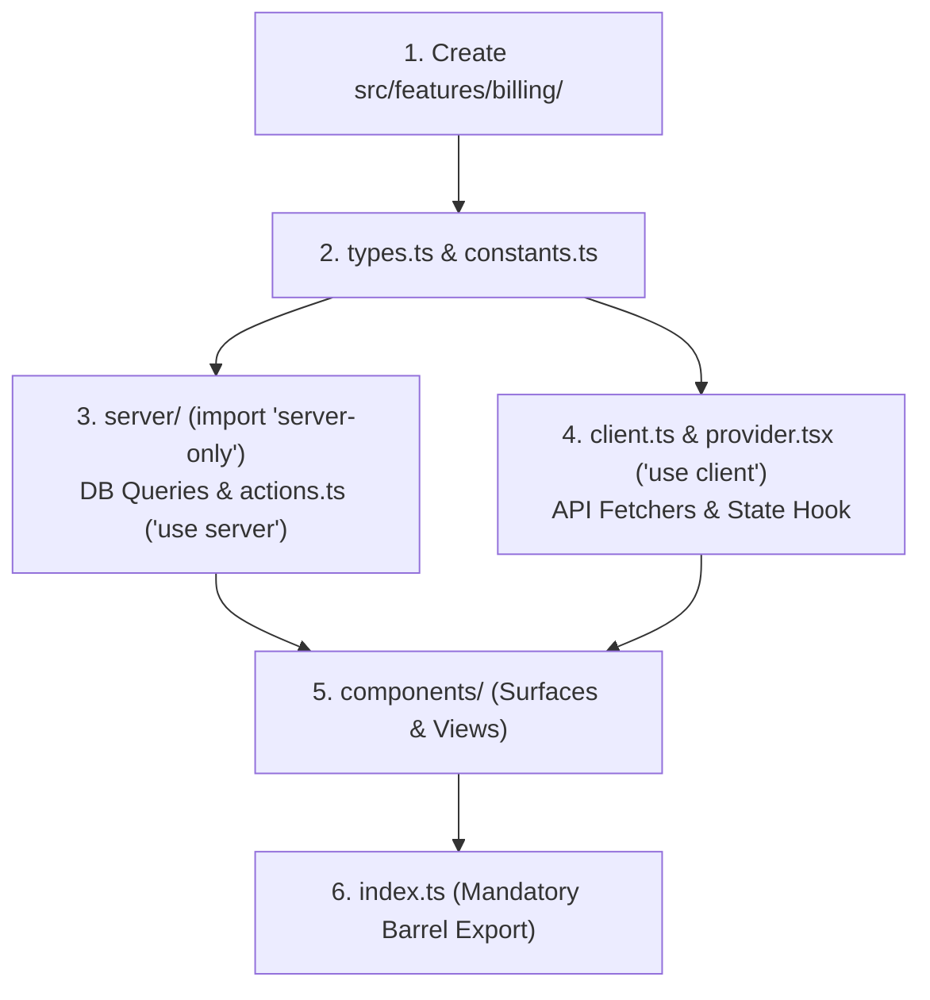
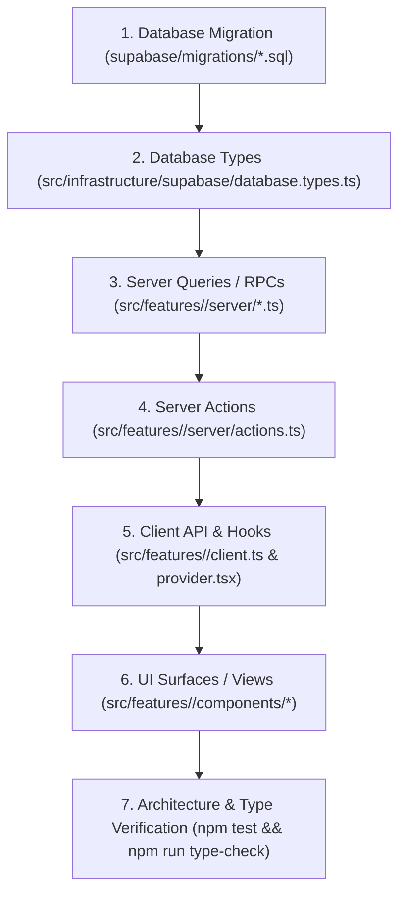

# Development Workflows & Implementation Blueprints

This guide provides concrete, step-by-step blueprints for building websites, adding features, creating task surfaces, and safely modifying existing code on Base Framework.

---

## Blueprint 1: How to Build a New Website on Base Framework

Base Framework is the engine; your website is the domain consumer. Follow this 4-step process to build a new site:

### Step 1: Configure App Registry (`src/app/registry.tsx`)

Declare the site's route tree, icons, descriptions, and lazy-loaded modal components:

```tsx
// src/app/registry.tsx
import dynamic from "next/dynamic";
import { REGISTRY_TYPES, type AppRegistryEntry } from "@/core/orchestration";

const SettingsModal = dynamic(
  () => import("@/features/settings/components/settings-modal"),
  { ssr: false },
);

export const APP_REGISTRY_ENTRIES: readonly AppRegistryEntry[] = Object.freeze([
  {
    type: REGISTRY_TYPES.NAV,
    items: {
      "/": {
        description: "Homepage & Discover",
        icon: "solar:compass-bold",
        path: "/",
        title: "Discover",
      },
      "/projects": {
        description: "Portfolio Showcases",
        icon: "solar:folder-with-files-bold",
        path: "/projects",
        title: "Projects",
      },
      "/account": {
        description: "Manage Profile",
        icon: "solar:user-circle-bold",
        path: "/account",
        title: "Account",
      },
    },
  },
  {
    type: REGISTRY_TYPES.MODAL,
    items: {
      SETTINGS_MODAL: SettingsModal,
    },
  },
]);
```

### Step 2: Implement Page Routes (Server/Client Split)

For every route in `src/app/<route>/`, create two files:

1. **`page.tsx` (Server Component):** Handles metadata and async data fetching.

   ```tsx
   // src/app/projects/page.tsx
   import type { Metadata } from "next";
   import { ProjectsClient } from "./client";
   import { getPublicProjects } from "@/features/projects/server";

   export const metadata: Metadata = { title: "Projects" };

   export default async function ProjectsPage() {
     const initialProjects = await getPublicProjects();
     return <ProjectsClient initialProjects={initialProjects} />;
   }
   ```

2. **`client.tsx` (Client Component with `usePage`):** Configures page chrome and renders interactive UI.
   ```tsx
   // src/app/projects/client.tsx
   "use client";

   import { usePage } from "@/core/orchestration";

   export function ProjectsClient({
     initialProjects,
   }: {
     initialProjects: any[];
   }) {
     usePage({
       nav: {
         title: "Projects",
         description: "Curated Showcase",
         icon: "solar:folder-with-files-bold",
       },
       background: {
         image: "/media/projects-bg.jpg",
         overlay: true,
         overlayOpacity: 0.3,
       },
     });

     return (
       <main className="relative z-10 min-h-screen p-8 pt-24">
         <h1 className="text-3xl font-bold">Projects</h1>
         {/* Render items */}
       </main>
     );
   }
   ```

### Step 3: Populate Account Data Slots

In `src/app/account/[username]/client.tsx`, place your domain content inside `<AccountLayout>`:

```tsx
<AccountLayout
  account={account}
  followersCount={followersCount}
  followingCount={followingCount}
  isFollower={isFollower}
  isOwner={isOwner}
>
  {/* Project-Specific Data Slot */}
  <section className="mt-8">
    <h2 className="text-xl font-semibold mb-4">User Projects</h2>
    <ProjectGrid userId={account.id} />
  </section>
</AccountLayout>
```

### Step 4: Brand Theming (`src/app/globals.css`)

Update `:root` variables to reflect the site's brand colors:

```css
@layer base {
  :root {
    --white: #fcfcfb;
    --black: #0c0d0e;
    --primary: #1a1b1e;
  }
}
```

---

## Blueprint 2: How to Add a New Feature

When creating a new domain capability (e.g. `src/features/billing`):



### Step-by-Step Code Structure:

1. **`types.ts`:**
   ```typescript
   export interface Plan {
     id: string;
     name: string;
     price: number;
   }
   ```
2. **`server/plans.ts` (Server Database Fetcher):**
   ```typescript
   import "server-only";
   import { createServerSupabaseClient } from "@/infrastructure/supabase/server";

   export async function getSubscriptionPlans() {
     const client = await createServerSupabaseClient();
     const { data, error } = await client.from("billing_plans").select("*");
     if (error) throw error;
     return data;
   }
   ```
3. **`server/actions.ts` (Server Action with Result pattern):**
   ```typescript
   "use server";

   import { ok, err, type Result } from "@/core/result";
   import { requireUser } from "@/features/auth/server";

   export async function subscribeToPlanAction(
     planId: string,
   ): Promise<Result<{ subscribed: true }>> {
     try {
       const user = await requireUser();
       // Execute billing logic
       return ok({ subscribed: true });
     } catch (error: any) {
       return err(error?.message || "Subscription failed");
     }
   }
   ```
4. **`client.ts`:**
   ```typescript
   import { requestJson } from "@/infrastructure/http/client";

   export async function fetchInvoices() {
     return requestJson("/api/billing/invoices");
   }
   ```
5. **`index.ts` (Mandatory Barrel Export):**
   ```typescript
   "use client";

   export * from "./types";
   export * from "./constants";
   export * from "./client";
   export * from "./components/billing-surface";
   ```

---

## Blueprint 3: How to Add a New Task Surface to the Dock

Surfaces morph out of the navigation dock to handle inline workflows:

### 1. Define the Surface Component (`src/features/billing/components/billing-surface.tsx`):

```tsx
"use client";

import { useNavigationActions } from "@/core/modules/nav";
import { Button } from "@/core/primitives";

export function BillingSurfaceView() {
  const { closeSurface } = useNavigationActions();

  return (
    <div className="p-6 text-white">
      <h2 className="text-xl font-bold">Manage Subscription</h2>
      <p className="text-white/60 mt-1">Upgrade or cancel your plan.</p>
      <div className="mt-6 flex justify-end gap-3">
        <Button
          onClick={() => closeSurface()}
          className="bg-white/10 px-4 py-2 rounded-xl"
        >
          Close
        </Button>
      </div>
    </div>
  );
}

export function createBillingSurfaceEntry() {
  return {
    id: "billing-surface",
    component: BillingSurfaceView,
    title: "Billing & Plans",
  };
}
```

### 2. Invoke the Surface from Any Button or Page Action:

```tsx
import { useNavigationActions } from "@/core/modules/nav";
import { createBillingSurfaceEntry } from "@/features/billing";

export function UpgradeButton() {
  const { openSurface } = useNavigationActions();

  return (
    <button onClick={() => void openSurface(createBillingSurfaceEntry())}>
      Upgrade Plan
    </button>
  );
}
```

---

## Blueprint 4: How to Add a New Modal Dialog

Modals float above the page at `Z_INDEX.MODAL` (100) and return Promises:

### 1. Create the Modal Component:

```tsx
// src/features/projects/components/modals/confirm-delete-modal.tsx
"use client";

import { useModalActions } from "@/core/modules/modal";
import { Button } from "@/core/primitives";

export default function ConfirmDeleteModal({
  projectId,
}: {
  projectId: string;
}) {
  const { closeModal } = useModalActions();

  return (
    <div className="p-6 text-white max-w-sm">
      <h3 className="text-lg font-bold">Delete Project?</h3>
      <p className="mt-2 text-sm text-white/60">
        This action cannot be undone.
      </p>
      <div className="mt-6 flex justify-end gap-2">
        <Button onClick={() => closeModal({ confirmed: false })}>Cancel</Button>
        <Button
          onClick={() => closeModal({ confirmed: true })}
          className="bg-error text-white"
        >
          Delete
        </Button>
      </div>
    </div>
  );
}
```

### 2. Register in `src/app/registry.tsx`:

```tsx
const ConfirmDeleteModal = dynamic(
  () => import("@/features/projects/components/modals/confirm-delete-modal"),
  { ssr: false },
);

// Add to APP_REGISTRY_ENTRIES under REGISTRY_TYPES.MODAL
{
  type: REGISTRY_TYPES.MODAL,
  items: {
    CONFIRM_DELETE_MODAL: ConfirmDeleteModal,
  },
}
```

### 3. Open Modal and Await User Decision:

```tsx
const modal = useModal();
const result = await modal.openModal("CONFIRM_DELETE_MODAL", "center", {
  data: { projectId: "proj_123" },
});

if (result?.confirmed) {
  // Proceed with deletion
}
```

---

## Blueprint 5: How to Modify an Existing Feature

When modifying domain logic, trace changes in dependency order:



---

## 6. Local Database & Seed Accounts

Base Framework comes with realistic local seed data configured in [`supabase/seed.sql`](file:///Users/omerdlw/Documents/Base%20Framework/supabase/seed.sql).
Run `npm run supabase:reset` to apply migrations and seed data.

### Authentication Architecture: 100% Passwordless

Base Framework does **NOT** use passwords anywhere in the stack. Sign-in flows use:

1. **Email OTP / Magic Link:** Entering an email sends a 6-digit OTP code. In local development, Supabase captures all outgoing emails in **Inbucket** (`http://127.0.0.1:54324`).
2. **Passkeys / WebAuthn:** Fast biometric or device credential sign-in (`signInWithPasskey`).
3. **OAuth:** GitHub, Google, Twitter/X.

### Seed Accounts Reference

| Username        | Email                      | Role / Domain            | Profile Type                        | Local Auth Method                   |
| :-------------- | :------------------------- | :----------------------- | :---------------------------------- | :---------------------------------- |
| `alex_creator`  | `alex@baseframework.dev`   | Lead Architect & Creator | Public                              | Passwordless (Email OTP / Inbucket) |
| `sarah_dev`     | `sarah@baseframework.dev`  | Infrastructure Engineer  | Public                              | Passwordless (Email OTP / Inbucket) |
| `elena_design`  | `elena@baseframework.dev`  | Design Systems Lead      | **Private** (tests follow requests) | Passwordless (Email OTP / Inbucket) |
| `marcus_mobile` | `marcus@baseframework.dev` | Mobile Specialist        | Public                              | Passwordless (Email OTP / Inbucket) |
| `test_user`     | `test@baseframework.dev`   | Automated QA Sandbox     | Public                              | Passwordless (Email OTP / Inbucket) |

### Pre-populated Relationships & Activity

- **Social Graph:** Follow relationships in `accepted` and `pending` states.
- **Notifications:** Realistic `FOLLOW_REQUEST`, `FOLLOW_ACCEPTED`, `NEW_FOLLOWER`, `SYSTEM_ANNOUNCEMENT`, and `MENTION` events with full payload schemas.
- **Sessions:** Active macOS, iOS Safari, and Linux development sessions in `public.auth_sessions`.

---

## 7. Git Hook Automation & Code Verification

A pre-commit hook is provided in `.githooks/pre-commit` to automatically run architectural boundary tests and TypeScript checks before every commit.

```bash
# Install / activate git hooks
npm run hooks:install

# 1. Run architecture rules and boundary test suite
npm test

# 2. Run full TypeScript compiler verification
npm run type-check

# 3. Verify lint rules
npm run lint

# 4. Verify formatting
npm run format:check
```

---

## 8. Multi-Project Lifecycle: Scaffold, Sync & Core Contribution

Base Framework serves as an upstream engine for downstream projects (e.g. `Tvizzie`).

### 1. Scaffolding a New Project

To bootstrap a new website/project from Base Framework:

```bash
# 1. Clone Base Framework into a new project folder
git clone git@github.com:your-org/base-framework.git tvizzie
cd tvizzie

# 2. Run the automated scaffolder
npm run project:scaffold Tvizzie tvizzie.com

# 3. Configure Git remotes (Base Framework = upstream, Project = origin)
git remote rename origin upstream
git remote add origin git@github.com:your-org/tvizzie.git

# 4. Commit initial project state and push
git add -A
git commit -m "chore(scaffold): initialize Tvizzie on Base Framework"
git push -u origin main
```

The scaffolder automatically:

- Writes `project.config.json`
- Updates `package.json`, `supabase/config.toml`, `wrangler.jsonc`, and `src/app/layout.tsx`
- Resets stale AI artifacts and re-indexes the project
- Locks `.framework-manifest.json` to the current framework version
- Validates the project with `npm run project:validate`

### 2. Syncing Upstream Framework Updates

To pull new features and bugfixes from Base Framework into a downstream project:

```bash
# In downstream project (e.g. tvizzie):
npm run framework:sync

# Or preview updates without modifying files:
npm run framework:sync -- --check
```

The sync tool:

1. Verifies a clean working tree.
2. Fetches tags from `upstream`.
3. Merges the latest framework tag onto a `sync/upstream-<tag>` branch.
4. Executes `npm test` and `npm run typecheck` post-merge.
5. Updates `.framework-manifest.json` and commits if tests pass.

### 3. Contributing Core Enhancements (Tvizzie → Base Framework)

If you fix an engine bug or build a reusable feature in `src/core`:

```bash
# 1. Create a clean contribution branch based on upstream
git fetch upstream
git checkout -b contrib/nav-spring-fix upstream/main

# 2. Implement the fix in src/core and test
npm test && npm run type-check

# 3. Commit and push directly to Base Framework (upstream)
git commit -m "fix(core/nav): correct spring damping calculation"
git push upstream contrib/nav-spring-fix:feat/nav-spring-fix

# 4. Submit PR on GitHub to Base Framework.
# 5. After Base Framework releases a new tag (e.g. v1.1.0), pull it cleanly via:
npm run framework:sync
```
