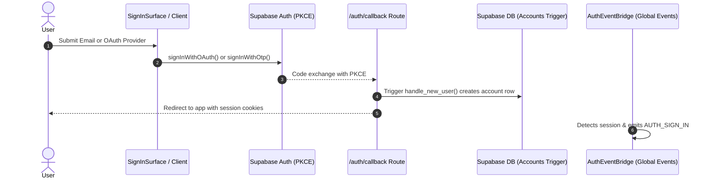
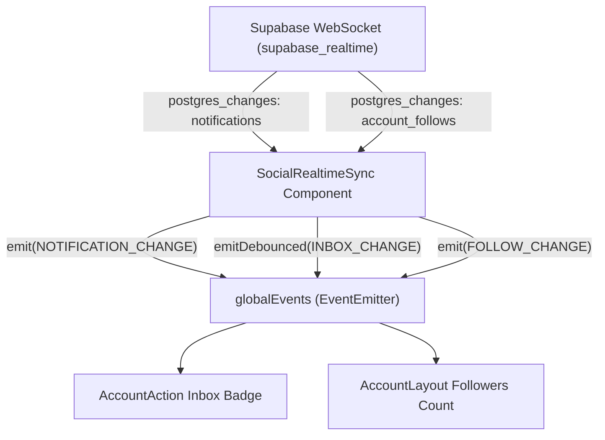

# Features & Domain Capabilities

Features in Base Framework represent domain capabilities (Authentication, Account Profiles, Social Relationships). All feature implementations reside in [`src/features`](file:///Users/omerdlw/Documents/Base%20Framework/src/features).

---

## 1. Feature Folder Anatomy & Tri-Part Architecture

Every feature adheres to a strict directory structure that isolates client components, server actions, database queries, and type contracts:

```
src/features/<feature-name>/
├── index.ts              # Mandatory barrel export (Client safe entry)
├── types.ts              # TypeScript interfaces and domain models
├── constants.ts          # Action keys, event keys, default state
├── utils.ts              # Pure helper functions
├── client.ts             # Client API wrappers (fetchers, passkeys, event triggers)
├── provider.tsx          # React Context provider & domain hooks
├── components/           # UI Surfaces, modal dialogs, and guard listeners
│   └── nav/              # Dock surfaces and action buttons
└── server/               # Strictly Server-Side Execution (or server.ts)
    ├── index.ts          # Server barrel export
    ├── actions.ts        # Next.js Server Actions ("use server")
    └── profile.ts        # DB queries & RPCs (import "server-only")
```

### The Tri-Part Execution Rules:

1. **Client Boundary (`index.ts` & `client.ts`):** Must contain `"use client"` if exporting React components or hooks. NEVER import or re-export anything from `server/` here.
2. **Server Logic Boundary (`server/*.ts`):** Must start with `import "server-only";`. Contains database queries, admin clients, and sensitive security logic.
3. **Server Action Boundary (`server/actions.ts`):** Must start with `"use server";`. Exports asynchronous functions directly invokable from client transitions and forms.

---

## 2. Feature 1: Authentication (`src/features/auth`)

The Auth feature provides enterprise-grade identity management using Supabase SSR, WebAuthn/Passkeys, and session security auditing.



### 2.1 Authentication Primitives (`src/features/auth/client.ts`)

- **OAuth:** `signInWithOAuth(provider, { next, scopes })`
- **Magic Link / OTP:** `requestEmailAuth(email, { next })`, `verifyEmailOtp(email, token, type)`
- **Passkeys (WebAuthn):**
  - `registerPasskey(name)`: Enrolls a hardware passkey (FIDO2 / TouchID / Windows Hello).
  - `signInWithPasskey()`: Passwordless biometric authentication.
  - `listPasskeys()`, `deletePasskey(id)`: Passkey management.
- **Sign Out:** `signOut(scope: "local" | "global" | "others")`.

### 2.2 Server-Side Guards (`src/features/auth/server.ts`)

- `getOptionalUser()`: Reads auth claims from encrypted cookies. Verifies against `auth_sessions` to ensure the session has not been revoked.
- `requireUser({ redirectTo })`: Enforces authentication. If unauthenticated, triggers a Next.js `redirect()` or throws an error.
- `requireRecentAuthentication(maxAgeSeconds)`: Step-up authentication. Inspects JWT `amr` (Authentication Method Reference) timestamps. If authentication is older than `DEFAULT_MAX_AUTH_AGE_SECONDS` (default: 300s), re-authentication is required (used when deleting an account or changing credentials).
- `assertSameOrigin(request)`: Strict CSRF protection for mutation routes.

### 2.3 Surfaces & Listeners

- **`SignInSurface` (`components/sign-in-surface.tsx`):** Dock task surface featuring OAuth buttons, Magic Link input, and Passkey triggers.
- **`AuthListener` (`components/auth-listener.tsx`):**
  - `AuthEventBridge`: Listens to auth state changes, saves the last known account, and dispatches `AUTH_SIGN_IN` / `AUTH_SIGN_OUT` / `AUTH_READY` events.
  - `AuthRequiredListener`: Subscribes to `EVENT_TYPES.AUTH_REQUIRED` and automatically slides open the `SignInSurface`.
  - `PageAuthGuard`: Enforces page-level auth policies declared in `usePage({ auth: true })`.

---

## 3. Feature 2: Account & Profiles (`src/features/account`)

Manages user profiles, usernames, avatars, banners, and account settings.

### 3.1 Database Integration & Queries (`src/features/account/server/profile.ts`)

- `getCurrentAccount({ client, userId })`: Fetches account metadata and linked primary email.
- `getPublicAccount({ client, username })`: Fetches public profile fields (`username`, `display_name`, `avatar_url`, `banner_url`, `bio`, `is_private`).
- `updateAccount({ client, input, userId })`: Updates profile fields via PostgreSQL RPC `update_account`.

### 3.2 Account Layout & Slots (`src/features/account/components/account-layout.tsx`)

`AccountLayout` is the reusable profile scaffold used across websites built on the framework:

```tsx
<AccountLayout
  account={account}
  followersCount={followersCount}
  followingCount={followingCount}
  isFollower={isFollower}
  isOwner={isOwner}
>
  {/* Project-Specific Data Slots Here:
      e.g. User Posts, Portfolios, Feeds, Items */}
</AccountLayout>
```

#### Layout Features:

- **Adaptive Backdrop Hero (`BackdropHero`):** Renders the user's banner image with smooth parallax and ambient lighting.
- **Smart Avatar Fallback:** Computes initial fallback characters or SVG placeholders if no avatar is uploaded.
- **Realtime Follow Stats (`useSocialFollowSync`):** Dynamically updates follower counts when `SOCIAL_EVENTS.FOLLOW_CHANGE` is emitted.
- **Integrated Bio Modal:** Clicking truncated bio opens `AccountBioSurface`.

### 3.3 Account Guard (`src/features/account/components/account-guard.tsx`)

- **`AccountRouteNavGuard`:** When a visitor attempts to access `/account` unauthenticated, it intercepts navigation, opens the `SignInSurface`, and redirects to `/` if dismissed.
- **`OAuthAccountSetupGuard`:** When a user logs in via OAuth for the first time without a chosen username (`?setup=account`), this guard intercepts the render and displays `AccountSetupSurface`.

---

## 4. Feature 3: Social & Realtime (`src/features/account/social`)

Implements follow/unfollow relationships, private account follow requests, notification badges, and real-time synchronization.

### 4.1 Server Actions (`src/features/account/server/actions.ts`)

- `followUserAction(followingId, targetUsername)`:
  - Inspects target account privacy: If `is_private === true`, creates a follow record with `status = 'pending'`; otherwise `status = 'accepted'`.
  - Revalidates profile route cache (`revalidatePath`).
  - Returns typed `FollowActionResult`.
- `unfollowUserAction(followingId, targetUsername)`:
  - Removes follow record and triggers route cache revalidation.

### 4.2 Realtime Sync Engine (`src/features/account/social/realtime.ts`)

`SocialRealtimeSync` is a zero-render background component mounted in `src/app/providers.tsx`:



- Subscribes to Supabase Realtime channel `social:user:${userId}`.
- Listens to PostgreSQL table mutations on `notifications` and `account_follows`.
- Converts database events into decoupled global events (`SOCIAL_EVENTS.FOLLOW_CHANGE`, `SOCIAL_EVENTS.INBOX_CHANGE`, `SOCIAL_EVENTS.NOTIFICATION_CHANGE`).
- Ensures zero coupling between Supabase realtime subscriptions and individual UI components.
