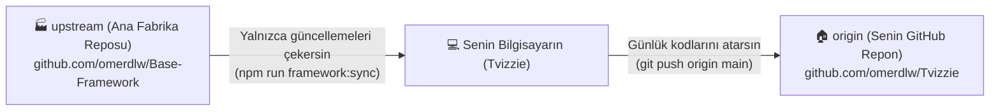
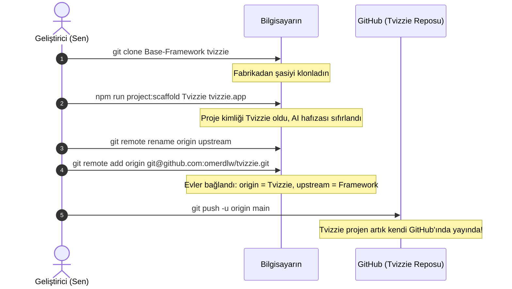
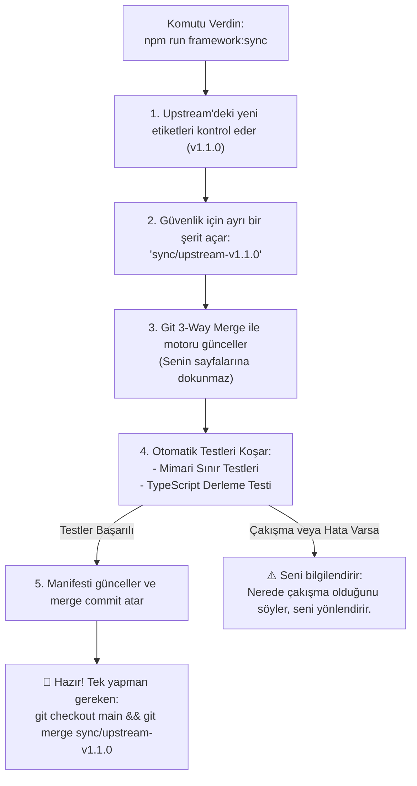
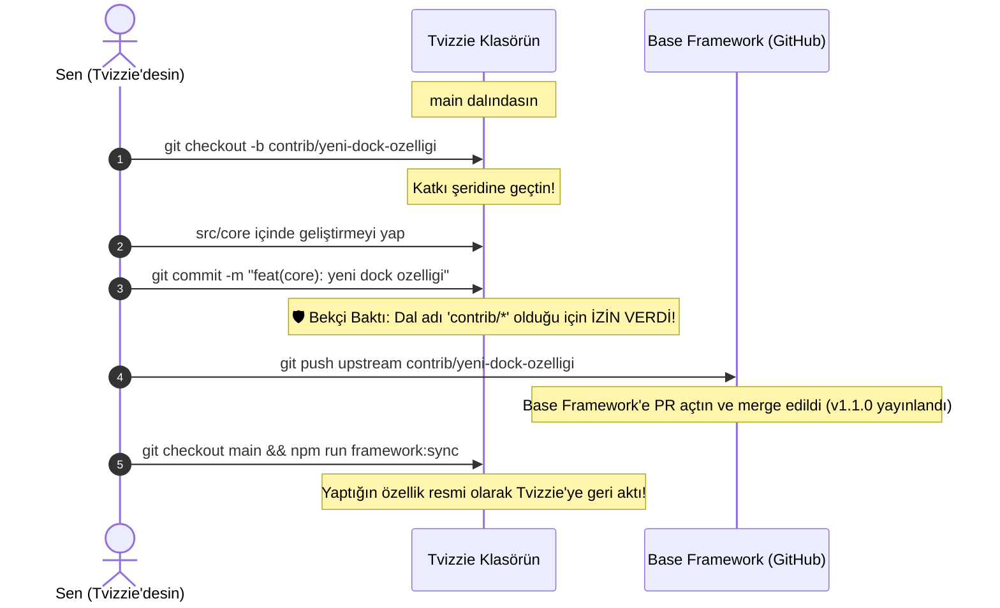

# Base Framework — Basit ve Görsel Git Rehberi

> **Bu kılavuzun amacı:** Git terminolojisine ve karmaşık komutlara boğulmadan, Base Framework ile bu framework üzerinden geliştireceğiniz projeler (örneğin **Tvizzie**) arasındaki Git ilişkisini en basit haliyle anlamanızı sağlamaktır.

---

## 1. Temel Mantık: Araba Fabrikası ve Özel Araçlar Analojisi

Bu sistemi anlamanın en kolay yolu bir **otomobil fabrikası** düşünmektir:

```
┌────────────────────────────────────────────────────────┐
│           BASE FRAMEWORK (Motor & Şasi Fabrikası)       │
│  - src/core (Motor, frenler, elektrik tesisatı)         │
│  - Temel altyapı ve mimari kurallar                    │
└───────────────────────────┬────────────────────────────┘
                            │
              Fabrikadan şasiyi alıp götürüyorsun
                            │
                            ▼
┌────────────────────────────────────────────────────────┐
│              TVİZZİE (Senin İnşa Ettiğin Özel Araç)     │
│  - Motor & Şasi: Fabrikadan geldi (src/core)           │
│  - Kaporta, Boya, Koltuklar: Senin tasarımın (src/app) │
│  - Özel Ekipmanlar: Senin özelliklerin (src/features)  │
└────────────────────────────────────────────────────────┘
```

- **Base Framework:** Fabrikadır. Arabanın yürüyen aksamını (`src/core`) üretir.
- **Tvizzie:** Bu şasi üzerine kurduğunuz özel arabadır (örneğin bir ambulans veya yarış arabası).
- **Amaç:** 6 ay sonra fabrika motora %20 performans artışı (`v1.1.0`) getirdiğinde, sizin Tvizzie için tasarladığınız kaportayı, boyayı veya koltukları bozmadan **sadece yeni motoru** arabanıza takabilmektir.

---

## 2. İki Uzak Ev: `origin` ve `upstream` Nedir?

Git kullanırken kafayı en çok karıştıran şey **"Uzak Sunucu" (Remote)** kavramıdır. Sizin bilgisayarınızdaki projenin konuştuğu **iki ayrı internet adresi** vardır:



| İsim           | Görevi                                                            | Ne Zaman Kullanılır?                                                                                                                 |
| :------------- | :---------------------------------------------------------------- | :----------------------------------------------------------------------------------------------------------------------------------- |
| **`origin`**   | **Senin Projenin Evi.** Tvizzie'nin kendi GitHub deposudur.       | Her gün yazdığınız sayfaları, tasarımları, özellikleri buraya yüklersiniz.                                                           |
| **`upstream`** | **Ana Fabrikanın Evi.** Base Framework'ün resmi GitHub deposudur. | Yalnızca fabrikaya yeni bir güncelleme (`v1.1.0`) geldiğinde oradan parça almak için kullanılır. Asla doğrudan oraya kod atmazsınız. |

---

## 3. Günlük Hayatta Karşılaşacağınız 4 Temel Senaryo

---

### SENARYO 1: Sıfırdan Yeni Bir Proje Başlatmak (Örn: Tvizzie)

Base Framework'ü temel alan yeni bir projeye başlarken izlenen 3 basit adım:



#### Terminalde Yazacağın Komutlar:

```bash
# 1. Base Framework'ü yeni proje klasörüne klonla
git clone https://github.com/omerdlw/Base-Framework.git tvizzie
cd tvizzie

# 2. Projeyi Tvizzie kimliğine büründür (Tek komut!)
npm run project:scaffold Tvizzie tvizzie.app

# 3. GitHub adreslerini ayarla
git remote rename origin upstream
git remote add origin https://github.com/omerdlw/tvizzie.git

# 4. İlk halini kendi GitHub'ına gönder
git add .
git commit -m "chore: initialize Tvizzie on Base Framework"
git push -u origin main
```

---

### SENARYO 2: Günlük Geliştirme (Tvizzie'ye Özellik Eklemek)

Tvizzie üzerinde çalışırken bildiğiniz normal Git akışını kullanırsınız. Sayfalar, bileşenler ve veritabanı işlemleri yaparsınız.

```
Senin Çalışma Alanın:
├── src/app/          ──► İstediğin gibi değiştir (Sayfalar, routing, tasarım)
├── src/features/     ──► İstediğin gibi değiştir (Tvizzie domain özellikleri)
└── src/core/         ──► ⚠️ DOĞRUDAN MAIN'DE DEĞİŞTİRİLMEZ!
                          (Burayı geliştirmek istersen Senaryo 4'teki gibi 'contrib/*' dalı açarsın)
```

#### 🛡️ Bekçi (Pre-Commit Hook) Neden Doğrudan Değişikliği Durdurur?

Diyelim ki Tvizzie'nin `main` dalındayken doğrudan `src/core/` içindeki bir dosyayı değiştirdin ve `git commit` dedin:

```
❌ [pre-commit] Immutable Core Violation!
    Direct modifications to 'src/core/' are strictly prohibited on project branches ('main').
    In downstream projects, 'src/core' is an upstream-managed immutable engine.
```

Bekçi burada şunu demek ister:

> _"Dur! `src/core` ortak motordur. Bunu doğrudan Tvizzie'nin `main` dalına kaydedersen, bu kod sadece Tvizzie'nin içine hapsolur. Ana Base Framework'e ve gelecekteki diğer projelerine aktaramazsın. Ayrıca yarın framework güncellendiğinde Git çakışması (conflict) yaşarsın!"_

**Peki ben hem Tvizzie hem de Base Framework için faydalı bir Core geliştirmesi yapmak istiyorsam ne yapacağız?**  
Sistem bunu **tamamen destekler!** Tek yapman gereken alttaki **Senaryo 4** akışını uygulamaktır.

---

### SENARYO 3: Fabrikaya Güncelleme Geldi (Base Framework v1.0 ➔ v1.1)

Base Framework ekibi yeni bir özellik yayınladı veya bir performans sorununu çözdü. Bu güncellemeyi Tvizzie'ye nasıl aktarırsın?

**Sadece tek bir komutla:**

```bash
npm run framework:sync
```

#### Arka Planda Ne Olur? (Otomatik Güvenlik Akışı)



- Bu işlem ana `main` dalını doğrudan bozmaz.
- Önce geçici bir test şeridinde birleştirme yapar, test eder.
- Başarılı olursa seni bilgilendirir.

---

### SENARYO 4: Core İçinde Hem Tvizzie Hem Base Framework İçin Faydalı Bir Geliştirme Yapmak

İşte en kritik soru:  
**"Tvizzie üzerinde çalışırken `src/core` içinde harika bir fikir aklıma geldi (örneğin dock menüsüne yeni bir özellik). Hem Tvizzie'de kullanmak hem de ana Base Framework'e kazandırmak istiyorum. Bunu nasıl yapacağım?"**

Sistemde bunun için özel olarak tasarlanmış **Katkı Şeridi (`contrib/*`)** mekanizması vardır:



#### Adım Adım Nasıl Yapılır?

1. **Özel bir katkı dalı açarsın:**
   ```bash
   git checkout -b contrib/yeni-dock-ozelligi
   ```
2. **`src/core/` içinde istediğin değişikliği yaparsın ve commit atarsın:**
   ```bash
   git add src/core/
   git commit -m "feat(core): add new dock capability"
   ```
   _Bekçi bakar: Dal adı `contrib/` ile başladığı için commit'e **seve seve izin verir**._
3. **Değişikliği Base Framework'e gönderirsin:**
   ```bash
   git push upstream contrib/yeni-dock-ozelligi
   ```
   _(GitHub üzerinde Base Framework'e bir Pull Request açılır ve kod ana framework'e dahil edilir)._
4. **Base Framework yeni sürüm çıkarır (`v1.1.0`).**
5. **Tvizzie'de `npm run framework:sync` dersin:**
   Geliştirdiğin bu harika özellik, artık resmi bir Base Framework parçası olarak hem Tvizzie'ye hem de ileride açacağın tüm diğer projelere otomatik olarak kazandırılmış olur!

#### Özet Fark:

- **`main` dalında `src/core` değiştirmek:** ⛔ YASAK (Kod Tvizzie'ye hapsolur, güncellemeler bozulur).
- **`contrib/*` dalında `src/core` değiştirmek:** ✅ TAMAMEN SERBEST (Kod ana framework'e gider, herkese fayda sağlar).

---

## 4. En Çok Merak Edilen 5 Soru

### 1. "Tvizzie'de yazdığım gizli kodlar Base Framework'e gider mi?"

**Kesinlikle Hayır.** Tvizzie'de yaptığınız commit'ler yalnızca sizin `origin`'inize (yani Tvizzie GitHub deposuna) gider. Base Framework'ün bundan haberi bile olmaz.

### 2. "Framework'ü güncelleyince (`sync`), Tvizzie için yaptığım sayfalar silinir mi?"

**Hayır.** Git son derece zekidir. `src/features/` ve `src/app/` sizin özel alanınızdır. Framework güncellemesi sadece `src/core/` (ve ortak kütüphaneler) üzerinde değişiklik yapar. Sizin yazdığınız sayfalara dokunmaz.

### 3. "İki taraf da `package.json`'a yeni paket eklediyse ne olur?"

Buna **Merge Conflict (Çakışma)** denir. Dünyanın sonu değildir. `sync` komutu durur ve sana şunu der:

> _"Sen de yeni bir paket eklemişsin, Base Framework de yeni bir paket eklemiş. Lütfen `package.json` dosyasını açıp ikisini de koruyacak şekilde kaydet."_
> Dosyayı düzenleyip kaydedersin ve senkronizasyon tamamlanır.

### 4. "`project.config.json` dosyası ne işe yarıyor?"

Projenin nüfus cüzdanıdır:

```json
{
  "name": "Tvizzie",
  "slug": "tvizzie",
  "domain": "tvizzie.app"
}
```

Proje adı veya domain değiştiğinde 10 farklı konfigürasyon dosyası aramazsınız; sadece burayı değiştirirsiniz, tüm sistem (`package.json`, Cloudflare `wrangler.jsonc`, Supabase `config.toml`, web metadata) otomatik uyum sağlar.

### 5. "AI araçlarının (Graphify, Codebase Memory) hafızası projeler arasında karışır mı?"

**Hayır.** Tüm AI hafızaları ve indeks dosyaları Git tarafından tamamen yok sayılır (`.gitignore`). Tvizzie'nin hafızası Tvizzie'de kalır, Base Framework'ünki Base Framework'te kalır.

---

## 5. Tüm Git Komutları Sözlüğü ve Pratik Kullanım Rehberi (Cheat Sheet)

Git komutlarını ezberlemek zorunda değilsin. İhtiyacın olan duruma göre aşağıdaki listeyi rehber olarak kullanabilirsin.

---

### Kategori A: Yeni Bir Projeye Başlarken (Yalnızca 1 Kez Kullanılır)

| Komut                                                             | Ne Zaman Kullanılır?                               | Ne Yapar? (Basitçe)                                                                    |
| :---------------------------------------------------------------- | :------------------------------------------------- | :------------------------------------------------------------------------------------- |
| `git clone https://github.com/omerdlw/Base-Framework.git <proje>` | Base Framework'ü bilgisayarına ilk kez indirirken. | GitHub'daki ana fabrikayı bilgisayarına temiz bir klasör olarak kopyalar.              |
| `npm run project:scaffold <Ad> <domain>`                          | Klonlama biter bitmez projeyi özelleştirirken.     | Projenin kimliğini (ad, domain, paketler, veritabanı ayarları) tek seferde değiştirir. |
| `git remote rename origin upstream`                               | Projeyi kendi GitHub repona bağlamadan hemen önce. | İndirdiğin Base Framework adresinin adını "upstream" (fabrika) yapar.                  |
| `git remote add origin https://github.com/<sen>/<proje>.git`      | Kendi GitHub repository adresini eklerken.         | Senin kendi GitHub deponu projenin asıl evi ("origin") olarak tanımlar.                |
| `git push -u origin main`                                         | Projenin ilk halini kendi GitHub'ına gönderirken.  | Sıfırdan oluşturduğun projeyi kendi GitHub repona ilk kez yükler.                      |

---

### Kategori B: Günlük Çalışma Akışı (Her Gün Kullanacağın 4 Komut)

Kod yazarken gün içinde sırasıyla şu 4 komutu kullanırsın:

#### 1. Durumu Kontrol Et: `git status`

- **Ne zaman?** "Şu an hangi dosyaları değiştirdim, durum ne?" diye merak ettiğin her an.
- **Ne yapar?** Değiştirdiğin dosyaları kırmızı/yeşil olarak listeler. Projeye hiçbir zarar vermeyen, en güvenli kontrol komutudur.

#### 2. Değişiklikleri Pakete Ekle: `git add .`

- **Ne zaman?** Bir sayfayı veya özelliği kodlamayı bitirdiğinde.
- **Ne yapar?** Yaptığın tüm değişiklikleri bir "paket" haline getirilmek üzere hazırlar (staged yapar).
- _Tek bir dosyayı eklemek istersen:_ `git add src/app/page.tsx`

#### 3. Paketi İsimlendir ve Kaydet: `git commit -m "açıklama"`

- **Ne zaman?** Hazırladığın pakete bir başlık verip bilgisayarındaki Git geçmişine kaydetmek istediğinde.
- **Ne yapar?** Değişiklikleri kalıcı bir versiyon noktası olarak dondurur.
- _Örnek:_ `git commit -m "feat: add about page"`

#### 4. GitHub'a Gönder: `git push origin main`

- **Ne zaman?** Bilgisayarında commit ettiğin paketleri GitHub'daki kendi repona yüklemek istediğinde.
- **Ne yapar?** Bilgisayarındaki güncel kodları internete (senin GitHub repona) yedekler ve yayınlar.

---

### Kategori C: Kontrol ve Yön Bulma Komutları

| Komut                    | Ne Zaman Kullanılır?                                           | Ne Yapar?                                                              |
| :----------------------- | :------------------------------------------------------------- | :--------------------------------------------------------------------- |
| `git log --oneline -n 5` | "En son hangi commit'leri atmıştım?" dediğinde.                | Son 5 commit'i tek satır özetler halinde gösterir.                     |
| `git branch`             | "Şu an hangi daldayım?" diye baktığında.                       | Bulunduğun dalın yanına `*` koyarak listeler (ör. `* main`).           |
| `git remote -v`          | "Projem hangi GitHub adreslerine bağlı?" diye kontrol ederken. | `origin` (senin repon) ve `upstream` (framework) adreslerini gösterir. |

---

### Kategori D: Framework Güncellemelerini Alırken (Sync)

| Komut                                       | Ne Zaman Kullanılır?                                             | Ne Yapar?                                                                 |
| :------------------------------------------ | :--------------------------------------------------------------- | :------------------------------------------------------------------------ |
| `npm run framework:sync -- --check`         | "Base Framework'e yeni bir güncelleme gelmiş mi?" diye bakarken. | Güncelleme olup olmadığını kontrol eder, hiçbir dosyayı değiştirmez.      |
| `npm run framework:sync`                    | Yeni sürümü Tvizzie'ye güvenle içeri almak istediğinde.          | Ayrı bir `sync/*` dalında motoru günceller, testleri koşar ve hazır eder. |
| `git checkout main && git merge sync/<dal>` | `framework:sync` testi geçip başarılı olunca.                    | Hazırlanan güncellemeyi asıl `main` dalına aktarır.                       |

---

### Kategori E: Core İçin Katkı Sağlarken (Contrib)

| Komut                                 | Ne Zaman Kullanılır?                                                            | Ne Yapar?                                                           |
| :------------------------------------ | :------------------------------------------------------------------------------ | :------------------------------------------------------------------ |
| `git checkout -b contrib/<ozellik>`   | `src/core` içinde hem Base Framework hem Tvizzie için geliştirme yapmadan önce. | Bekçinin izin vereceği özel bir katkı dalı açar ve oraya geçer.     |
| `git push upstream contrib/<ozellik>` | Core geliştirmesini bitirip Base Framework'e göndermek istediğinde.             | Dalı doğrudan Base Framework deposuna gönderir (PR açabilmen için). |
| `git checkout main`                   | Katkı işi bittiğinde Tvizzie'nin ana çalışma alanına geri dönerken.             | Seni tekrar `main` dalına geri taşır.                               |
| `git branch -D contrib/<ozellik>`     | PR merge edildikten sonra açtığın geçici katkı dalını silerken.                 | Bilgisayarında kalabalık yapmaması için katkı dalını temizler.      |

---

### Kategori F: "Eyvah! Bir Şeyler Ters Gitti" (Kurtarma Çantası)

| Sorun / Durum                                                                  | Çözüm Komutu               | Ne Yapar?                                                                                      |
| :----------------------------------------------------------------------------- | :------------------------- | :--------------------------------------------------------------------------------------------- |
| **Bir dosyayı bozdum, son commit'teki haline geri dönsün:**                    | `git restore <dosya_yolu>` | Dosyadaki kaydedilmemiş tüm değişiklikleri silip son sağlam haline çevirir.                    |
| **Yaptığım her şeyi çöpe atıp son commit'e dönmek istiyorum:**                 | `git restore .`            | Tüm çalışma alanını son commit anına sıfırlar.                                                 |
| **Bekçi uyardı (`Immutable Core Violation`), yanlışlıkla core değiştirmişim:** | `git restore src/core/`    | Yanlışlıkla `src/core`'da yaptığın değişikliği geri alır, bekçinin uyarısını çözer.            |
| **Sync veya merge yaparken işler karıştı, vazgeçip başa dönmek istiyorum:**    | `git merge --abort`        | Yürütülen birleştirme işlemini derhal iptal eder, hiçbir şey olmamış gibi önceki duruma döner. |

---

## 6. Asla Unutmaman Gereken 3 Altın Kural

1. **`git status` senin pusulandır:** Bir sonraki adımı kestiremediğinde veya şüpheye düştüğünde terminale `git status` yaz. Sana nerede olduğunu ve ne yapman gerektiğini söyler.
2. **Kendi repona sadece `origin` ile kod atarsın:** Normal günlerde tek yapacağın push komutu `git push origin main`dir. Asla yanlışlıkla framework'e kod gitmez.
3. **Core'da geliştirme yapacaksan dal adının başına `contrib/` koyarsın:** `git checkout -b contrib/benim-fikrim` dediğin anda sistem sana sınırsız özgürlük tanır.
