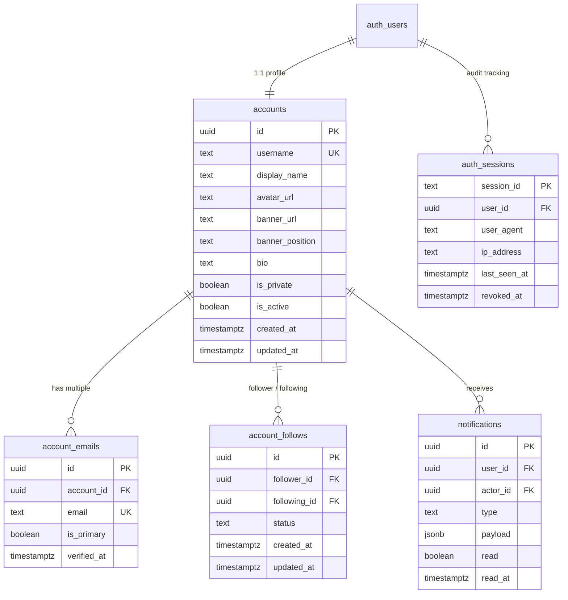
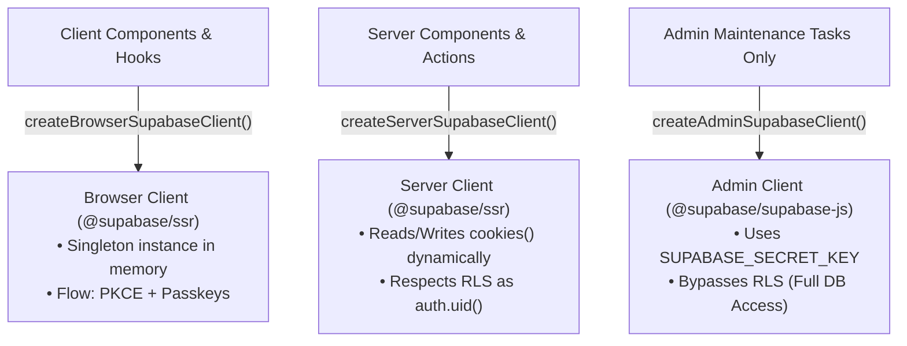

# Infrastructure & Data Layer Architecture

The Infrastructure layer located in [`src/infrastructure`](file:///Users/omerdlw/Documents/Base%20Framework/src/infrastructure) and the database schema in [`supabase/migrations`](file:///Users/omerdlw/Documents/Base%20Framework/supabase/migrations) manage cloud adapters, database models, security enforcement, and network boundaries.

---

## 1. Database Architecture & Schema

Base Framework runs on PostgreSQL via Supabase. All migrations are version-controlled in `supabase/migrations/`:



### Table Definitions & Invariants:

1. **`accounts`:**
   - Primary key matches `auth.users.id`.
   - Username format validation: `^[a-z0-9](?:[a-z0-9_-]{1,28}[a-z0-9])?$`.
   - Indexes on `username` and `is_private`.
2. **`account_emails`:**
   - Stores verified email addresses linked to the account. Primary email lookup index on `lower(email)`.
3. **`account_follows`:**
   - Unique constraint `uq_account_follows` on `(follower_id, following_id)`.
   - Constraint `chk_no_self_follow` prevents self-following (`follower_id != following_id`).
   - Status enumeration: `pending`, `accepted`, `rejected`.
4. **`auth_sessions`:**
   - Audit log for active user sessions. Tracks IP address and user agent.
   - Session revocation timestamp `revoked_at` enables immediate remote logout across devices.
5. **`notifications`:**
   - Realtime notification events with generic `jsonb payload`.

---

## 2. Row-Level Security (RLS) & Triggers

All tables have RLS enabled by default:

### RLS Policies:

- **`accounts`:**
  - SELECT: Public profiles viewable by everyone (`USING (true)`).
  - INSERT / UPDATE: Restricted to the authenticated owner (`auth.uid() = id`).
- **`account_emails`:**
  - SELECT / UPDATE: Restricted to account owner (`auth.uid() = account_id`).
- **`account_follows`:**
  - SELECT: Accepted follows are public (`status = 'accepted'`); pending follows viewable only by participants.
  - INSERT: Caller must be the follower (`auth.uid() = follower_id`).
  - UPDATE / DELETE: Permitted to either the follower or following user.
- **`auth_sessions`:**
  - ALL: Restricted to session owner (`auth.uid() = user_id`).
- **`notifications`:**
  - SELECT / UPDATE / DELETE: Restricted to recipient (`auth.uid() = user_id`).
  - INSERT: Permitted to authenticated users creating an event for an actor.

### Automated Triggers:

1. **`trg_accounts_updated_at` / `trg_account_follows_updated_at`:**
   - Automatically executes `public.handle_updated_at()` before every `UPDATE`.
2. **`on_auth_user_created`:**
   - Fires after `INSERT ON auth.users`.
   - Generates a clean, unique username from email/metadata.
   - Automatically populates initial rows in `public.accounts` and `public.account_emails`.

### Realtime Publication:

PostgreSQL publications `notifications` and `account_follows` are registered to `supabase_realtime`:

```sql
ALTER PUBLICATION supabase_realtime ADD TABLE public.notifications;
ALTER PUBLICATION supabase_realtime ADD TABLE public.account_follows;
```

---

## 3. Stored Procedures (PostgreSQL RPCs)

Defined in SQL with `SECURITY DEFINER` and `SET search_path = public`:

| Function Name                    | Parameters                                      | Behavior                                                                        |
| :------------------------------- | :---------------------------------------------- | :------------------------------------------------------------------------------ |
| **`touch_auth_session`**         | `p_session_id`, `p_ip_address`, `p_user_agent`  | Upserts session heartbeat into `auth_sessions`, updating `last_seen_at`.        |
| **`revoke_auth_session`**        | `p_session_id`                                  | Sets `revoked_at = now()` for a single session owned by the caller.             |
| **`revoke_other_auth_sessions`** | `p_current_session_id`                          | Revokes all active sessions for the caller except the current one.              |
| **`update_account`**             | Profile patch fields (`p_username`, `p_bio`...) | Updates profile fields for `auth.uid()` and returns updated account record.     |
| **`deactivate_current_account`** | None                                            | Sets `is_active = false` for the authenticated caller.                          |
| **`reactivate_current_account`** | None                                            | Sets `is_active = true` for the authenticated caller.                           |
| **`get_account_follow_target`**  | `p_user_id`                                     | Returns `(id, is_private)` for a target user to evaluate follow request status. |

---

## 4. The Supabase Client Factory Trio

Defined in [`src/infrastructure/supabase`](file:///Users/omerdlw/Documents/Base%20Framework/src/infrastructure/supabase):



### 4.1 Browser Client (`client.ts`)

- Uses `createBrowserClient` from `@supabase/ssr`.
- Singleton pattern ensures a single instance exists throughout the browser session.
- Experimental Passkey support enabled: `auth: { experimental: { passkey: true }, flowType: "pkce" }`.

### 4.2 Server Client (`server.ts`)

- Must only be imported from server contexts (`import "server-only";`).
- Uses Next.js 16 asynchronous `cookies()` store.
- Reads and writes encrypted session cookies automatically during server rendering and Server Actions.

### 4.3 Admin Client (`server.ts`)

- Instantiated with `requireSupabaseSecretKey()`.
- Completely bypasses Row-Level Security.
- **Security Rule:** NEVER use the admin client for standard user queries. It is strictly reserved for user account deletion (`admin.auth.admin.deleteUser`) or administrative batch jobs.

---

## 5. Edge Proxy & Session Middleware (`src/proxy.ts`)

Next.js 16 edge middleware is implemented in `src/proxy.ts` delegating to `updateSupabaseSession` in `src/infrastructure/supabase/proxy.ts`:

### Responsibilities:

1. **Session Touch Heartbeat:** For every authenticated incoming request, calls `touch_auth_session` RPC with user agent and client IP.
2. **Session Revocation Enforcement:** Checks `auth_sessions.revoked_at`. If the session was revoked from another device:
   - Immediately clears auth cookies.
   - Redirects user to `/?reason=session-revoked`.
3. **Security Response Headers:** Automatically attaches security headers to every response:
   - `X-Frame-Options: DENY`
   - `X-Content-Type-Options: nosniff`
   - `Referrer-Policy: strict-origin-when-cross-origin`
   - `Strict-Transport-Security: max-age=63072000; includeSubDomains; preload`
   - `Permissions-Policy: camera=(), microphone=(), geolocation=()`

---

## 6. HTTP Client (`src/infrastructure/http/client.ts`)

A standardized wrapper around `fetch` for internal and external JSON requests:

```typescript
export async function requestJson<T = any>(
  path: string,
  options: RequestJsonOptions = {},
): Promise<T>;
```

### Decoupled Error Handling & Events:

- Automatically attaches `"content-type": "application/json"`.
- Parses response errors into a typed `HttpError`.
- **Automatic Event Emission:**
  - Status `401`: Emits `EVENT_TYPES.API_UNAUTHORIZED` on `globalEvents`.
  - Other errors: Emits `EVENT_TYPES.API_ERROR` on `globalEvents`.

---

## 7. Security & Rate Limiting (`src/infrastructure/security/rate-limiter.ts`)

Protects API routes from brute-force and denial-of-service attacks:

### Features:

- **Sliding Window Algorithm:** In-memory counter tracked against timestamps (`limit`, `windowMs`).
- **Cloudflare IP Resolution (`getClientIp`):**
  1. `cf-connecting-ip` (Cloudflare edge proxy header)
  2. `x-real-ip`
  3. `x-forwarded-for` (first IP)
  4. Fallback: `127.0.0.1`
- **Response Helper:** `createRateLimitExceededResponse(result)` automatically generates HTTP 429 responses with `Retry-After`, `X-RateLimit-Limit`, `X-RateLimit-Remaining`, and `X-RateLimit-Reset` headers.
