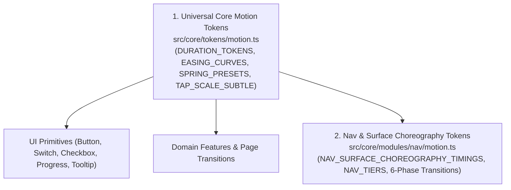

# Motion & Styling Architecture

Base Framework features a unified motion and styling engine combining universal motion tokens (`src/core/tokens/motion.ts`), deterministic JavaScript choreography scheduling (`src/core/modules/nav/motion.ts`), Motion (Framer Motion v13) GPU hardware acceleration, Tailwind CSS v4 with OKLCH semantic palettes, and a strict Z-index layering contract.

---

## 1. Motion Design Principles & GPU Acceleration

Motion in Base Framework is engineered to feel physical, responsive, and predictable—modeled after macOS Dock and iOS sheet physics.

### 1.1 GPU-Only Composite Properties

Layout reflow properties (`top`, `left`, `width`, `height`, `margin`, `padding`) trigger expensive CPU layout recalculations and frame drops. All spatial animations must strictly animate compositor properties:

- `transform: translate3d(x, y, 0) scale(s)`
- `opacity`

### 1.2 Pixel Snapping (Subpixel Anti-Shimmering)

Position calculations across cards and floating rails use integer pixel rounding (`Math.round(y)`). This eliminates subpixel font blurriness and edge shimmering on high-DPI displays during movement.

### 1.3 The Compositor Style Contract (`COMPOSITOR_GPU_STYLE` / `NAV_COMPOSITOR_STYLE`)

Animated surfaces apply GPU layer stabilization styles exported from [`src/core/tokens/motion.ts`](file:///Users/omerdlw/Documents/Base%20Framework/src/core/tokens/motion.ts):

```typescript
export const COMPOSITOR_GPU_STYLE = Object.freeze({
  WebkitFontSmoothing: "antialiased",
  backfaceVisibility: "hidden",
  transform: "translateZ(0)",
} as const);
```

- **No `contain: paint`:** Omitted on interactive cards to prevent rendering seam flashes in Chromium.
- **No Compound Blur:** Elements nested inside `backdrop-blur` containers avoid secondary CSS `filter: blur(...)` animations to prevent GPU texture thrashing.

---

## 2. Two-Tier Motion Token Architecture

Base Framework organizes motion constants into two clean tiers so primitives and features never need to import internal navigation module files:



### 2.1 Tier 1: Universal Core Motion Tokens (`src/core/tokens/motion.ts`)

Exported from `@/core/tokens` for use in all UI primitives, domain features, and pages:

| Constant                       | Values / Curves                                                                                                                         | Purpose                                                                      |
| :----------------------------- | :-------------------------------------------------------------------------------------------------------------------------------------- | :--------------------------------------------------------------------------- |
| **`DURATION_TOKENS`**          | `INSTANT: 0.1`, `MICRO: 0.18`, `FAST: 0.26`, `NORMAL: 0.36`, `SMOOTH: 0.52`, `FLUID: 0.68`, `SURFACE: 0.84`                             | Canonical tween durations (in seconds) across all non-dock components.       |
| **`EASING_CURVES`**            | `APPLE_SPRING_OUT: [0.22, 1, 0.36, 1]`, `FLUID_OUT: [0.16, 1, 0.3, 1]`, `SHARP_IO: [0.32, 0.72, 0, 1]`, `SMOOTH_RESIZE: [0.32, 0.12, 0.18, 1]` | Cubic-bezier curves tuned for Apple-style deceleration and morphing.         |
| **`SPRING_PRESETS`**           | `SNAPPY` (`stiffness: 420, damping: 32`), `FLUID` (`stiffness: 280, damping: 28`), `GENTLE` (`stiffness: 190, damping: 24`), `BOUNCY` | Pre-calibrated physical spring configurations for interactive controls.      |
| **`REDUCED_MOTION_TRANSITION`**| `{ duration: 0.01 }`                                                                                                                    | Instant transition fallback when `prefers-reduced-motion: reduce` is active. |
| **`TAP_SCALE_SUBTLE`**         | `{ scale: 0.97 }`                                                                                                                       | Tactile active press feedback for buttons and interactive cards.             |

### 2.2 Tier 2: Deterministic Nav & Surface Choreography (`src/core/modules/nav/motion.ts`)

The JavaScript state machine scheduler (`scheduler.ts`) tracks the 6-phase dock surface lifecycle in milliseconds (`NAV_SURFACE_CHOREOGRAPHY_TIMINGS`). Motion tween durations in `src/core/modules/nav/motion.ts` are strictly locked to these millisecond values:

| Phase / Action             | JS Scheduler Timing (`ms`) | Motion Transition Constant          | Tween Duration (`s`) | Curve / Easing                           |
| :------------------------- | :------------------------- | :---------------------------------- | :------------------- | :--------------------------------------- |
| **Action Button Dismiss**  | `ACTION_DISMISS_MS: 260`   | `NAV_ACTION_DISMISS_TRANSITION`     | `0.26s`              | `[0.32, 0.72, 0, 1]`                     |
| **Surface Body Enter**     | `BODY_ENTER_MS: 800`       | `NAV_SURFACE_BODY_ENTER_TRANSITION` | `0.80s`              | `[0.25, 1, 0.35, 1]` (`FLUID`)           |
| **Surface Body Exit**      | `BODY_EXIT_MS: 320`        | `NAV_SURFACE_BODY_EXIT_TRANSITION`  | `0.32s`              | `[0.32, 0.72, 0, 1]`                     |
| **Header Swap**            | `HEADER_SWAP_MS: 520`      | `NAV_HEADER_SWAP_TRANSITION`        | `0.52s`              | `[0.16, 1, 0.3, 1]`                      |
| **Surface Resize / Morph** | `RESIZE_MS: 580`           | `NAV_SURFACE_RESIZE_TRANSITION`     | `0.58s`              | `[0.32, 0.12, 0.18, 1]` (`FLUID_RESIZE`) |
| **Compact Dock Restore**   | `RESTORE_MS: 400`          | `NAV_COMPACT_STACK_EXIT_TRANSITION` | `0.40s`              | `[0.16, 1, 0.3, 1]`                      |

---

## 3. Tailwind CSS v4 & Semantic OKLCH Palettes

The platform uses **Tailwind CSS v4** configured directly inside [`src/app/globals.css`](file:///Users/omerdlw/Documents/Base%20Framework/src/app/globals.css):

```css
@import "tailwindcss";

@theme {
  --color-black: var(--black);
  --color-white: var(--white);
  --color-primary: var(--primary);

  --font-zuume: var(--font-zuume);
}
```

### 3.1 Monochrome Glass Surface Helpers (`src/core/tokens/tokens.ts`)

[`src/core/tokens/tokens.ts`](file:///Users/omerdlw/Documents/Base%20Framework/src/core/tokens/tokens.ts) exports pre-composed monochrome glass Tailwind class maps (`SEMANTIC_SURFACE_CLASSES`) and action tone classes (`INFO_ACTION_TONE_CLASS`, `DESTRUCTIVE_ACTION_TONE_CLASS`, etc.) built entirely on `--white`, `--black`, and luminance opacity hierarchy (`bg-white/5`, `bg-white/10`, `ring-white/15`, `hover:bg-white hover:text-black`).

### 3.2 Custom Framework Utilities

- `.center`: Flexbox centering shorthand (`display: flex; align-items: center; justify-content: center;`).
- `.skeleton-block`: Hardware-composited shimmer placeholder (`background-color: rgb(252 252 251 / 0.05)`).

---

## 4. Typography & Fonts (`src/core/tokens/fonts.ts`)

- **Geist Sans (`--font-geist-sans`):** Primary UI variable typeface (`100–900`).
- **Zuume Bold (`--font-zuume`):** High-impact display typeface for hero metrics, counters, and headlines.

---

## 5. The Layering & Z-Index Contract (`Z_INDEX`)

Defined in [`src/core/tokens/tokens.ts`](file:///Users/omerdlw/Documents/Base%20Framework/src/core/tokens/tokens.ts#L1-L15):

```typescript
export const Z_INDEX = Object.freeze({
  BACKGROUND: 0,       // Multi-layer video / image / ambient canvas
  UI_ELEMENT: 10,      // Standard in-page content & cards
  NAV_BACKDROP: 40,    // Darkening scrim behind expanded dock surface
  MODAL_BACKDROP: 90,  // Modal dark scrim
  MODAL: 100,          // Floating modal stack
  NAV: 100,            // Dock navigation stack & side controls rails
  NOTIFICATION: 110,   // Toast notification alerts
  SELECT: 120,         // Select listbox menus & option popovers
  LOADING: 150,        // Blocking page loading overlay
  ERROR_OVERLAY: 200,  // Fatal error crash screen
  CONTEXT_MENU: 220,   // Custom cursor-anchored context menu
  TOOLTIP: 250,        // Hover action tooltips
} as const);
```

> [!CAUTION]
> **Z-Index Invariant:**  
> Never use arbitrary Tailwind classes like `z-50`, `z-[99]`, or `z-[9999]`. Always bind elevation to `Z_INDEX` constants (`style={{ zIndex: Z_INDEX.MODAL }}`).
