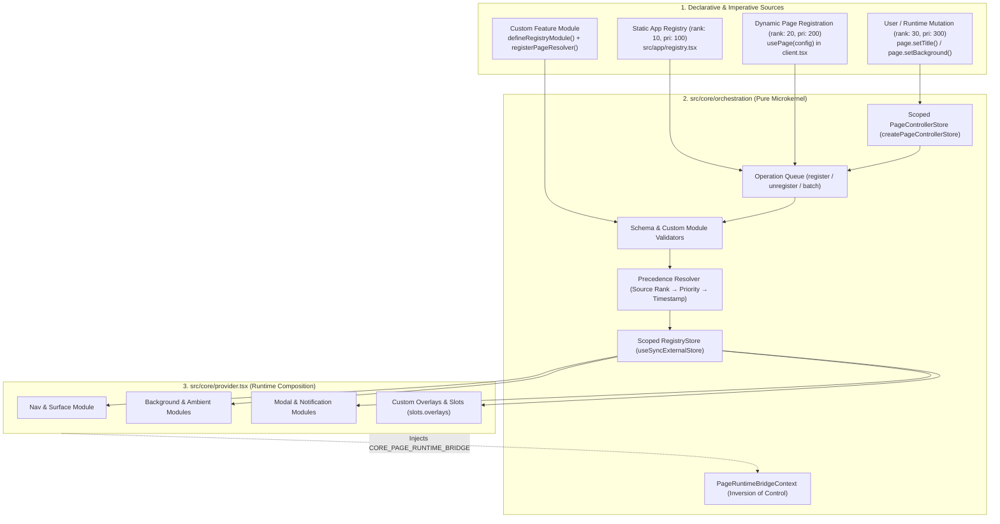
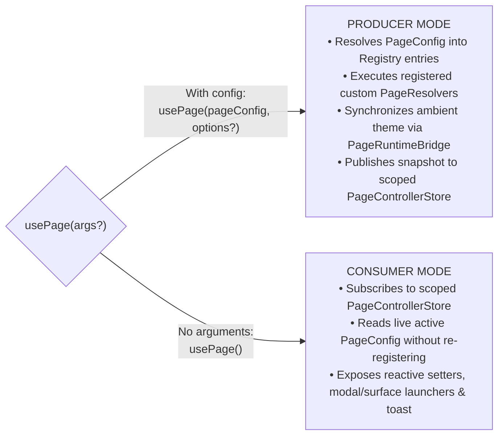

# Orchestration & Microkernel Registry Architecture

The Orchestration Engine in [`src/core/orchestration`](file:///Users/omerdlw/Documents/Base%20Framework/src/core/orchestration) is the central coordination microkernel of Base Framework. It enables pages, domain features, and downstream applications to declaratively control application-wide chrome (Navigation dock, multi-layer backgrounds, modal stacks, context menus, loading states, screen rails, and custom feature modules) with **zero circular dependencies** and **strict SSR isolation**.

---

## 1. Microkernel Design & Acyclic Architecture

Historically, UI frameworks suffer from tight coupling where the page controller directly imports every UI module (Navigation, Modal, Toast, Background, Ambient). In Base Framework, `src/core/orchestration` operates as a **pure, module-independent microkernel**:

- **Zero Module Imports:** `src/core/orchestration` has **0 imports** from `@/core/modules/*`, `@/features/*`, or `@/app/*`.
- **Inversion of Control via `PageRuntimeBridge`:** Instead of importing UI modules directly, `usePage()` delegates imperative actions (`surface`, `modal`, `toast`, `background`, `ambient`) through an injected runtime bridge (`PageRuntimeBridgeContext`) provided by [`src/core/provider.tsx`](file:///Users/omerdlw/Documents/Base%20Framework/src/core/provider.tsx).
- **SSR-Safe Scoped State:** Both the `RegistryStore` and `PageControllerStore` are instantiated per React tree inside `RegistryProvider` (`createPageControllerStore()`), preventing cross-request state pollution during Next.js Server-Side Rendering (SSR) while retaining a fallback store for isolated unit tests.



---

## 2. Built-In Registry Types & Lifecycle Policies

Defined in [`src/core/orchestration/constants.ts`](file:///Users/omerdlw/Documents/Base%20Framework/src/core/orchestration/constants.ts):

| Registry Type (`REGISTRY_TYPES`) | Key Policy  | Default Resolver | Value Kind  | Default Lifecycle | Cleanup Delay | Purpose                                                                 |
| :------------------------------- | :---------- | :--------------- | :---------- | :---------------- | :------------ | :---------------------------------------------------------------------- |
| `NAV`                            | `path`      | `merge`          | `object`    | `route`           | `600ms`       | Dock card metadata (`title`, `description`, `icon`, `banner`, `actions`) |
| `BACKGROUND`                     | `singleton` | `priority`       | `object`    | `immediate`       | `600ms`       | Multi-layer page background (video, image, gradient, noise, scrim)      |
| `CONTROLS`                       | `named`     | `priority`       | `object`    | `immediate`       | `0ms`         | Left/right viewport rail action toolbars alongside the dock             |
| `LOADING`                        | `singleton` | `priority`       | `object`    | `graceful`        | `600ms`       | Global or localized anti-flicker loading overlays and skeletons         |
| `MODAL`                          | `named`     | `priority`       | `component` | `immediate`       | `600ms`       | Promise-based modal dialog component definitions mapped by ID           |
| `CONTEXT_MENU`                   | `route`     | `priority`       | `object`    | `immediate`       | `600ms`       | Right-click contextual action menus bound to DOM selectors or routes    |

### Source Rank & Precedence Resolution

When multiple registrations target the same `(type, key)` pair, the engine deterministically resolves the winner using:

1. **Source Rank (`REGISTRY_SOURCE_RANK`):**
   - `USER` (`rank: 30`, default priority `300`): Runtime user/interaction overrides (`page.set(...)`).
   - `DYNAMIC` (`rank: 20`, default priority `200`): Route-level components calling `usePage(config)`.
   - `STATIC` (`rank: 10`, default priority `100`): Boot-time declarations in `APP_REGISTRY_ENTRIES`.
2. **Numeric Priority:** Higher priority number wins within the same source rank.
3. **Registration Order:** Later timestamp wins ties; for `merge` resolvers (`NAV`), properties are shallow-merged in precedence order so dynamic page props enrich static route definitions without wiping out static icons or paths.

---

## 3. The `usePage()` Hook (Dual-Mode Engine)

Defined in [`src/core/orchestration/page-controller.tsx`](file:///Users/omerdlw/Documents/Base%20Framework/src/core/orchestration/page-controller.tsx). `usePage` operates in two distinct modes depending on whether configuration arguments are passed:



### 3.1 Producer Mode (Configuring a Route in `client.tsx`)

Every route's client shell (`src/app/<route>/client.tsx`) calls `usePage(config)` once to declare its UI chrome:

```tsx
"use client";

import { usePage } from "@/core/orchestration";

export function ProjectsPageClient() {
  const page = usePage({
    nav: {
      title: "Projects",
      description: "Curated design & engineering showcases",
      icon: "solar:folder-with-files-bold",
    },
    background: {
      video: "/media/ambient-reel.mp4",
      videoOptions: { autoplay: true, loop: true, muted: true },
      overlay: true,
      overlayOpacity: 0.45,
    },
    ambient: {
      image: "/media/ambient-poster.jpg",
      tintGlobals: true,
    },
    actions: [
      {
        key: "projects.create",
        icon: "solar:add-circle-bold",
        tooltip: "Create Project",
        onClick: () => page.modal("CREATE_PROJECT_MODAL"),
      },
    ],
  });

  return (
    <main className="relative z-10 min-h-screen p-8 pt-24">
      {/* Page Content */}
    </main>
  );
}
```

### 3.2 Consumer Mode (Reading or Mutating from Deep Child Components)

Any deeply nested child widget can call `usePage()` with no arguments to read or mutate the active page state without prop drilling:

```tsx
"use client";

import { usePage } from "@/core/orchestration";
import { Button } from "@/core/primitives";

export function ProjectStatusBanner({ projectTitle }: { projectTitle: string }) {
  const page = usePage();

  const handlePublish = () => {
    page.setTitle(`${projectTitle} (Live)`);
    page.toast.success("Project published to showcase");
  };

  return (
    <div className="flex items-center justify-between">
      <span>Active Page: {page.config.title ?? page.config.nav?.title}</span>
      <Button onClick={handlePublish}>Publish</Button>
    </div>
  );
}
```

---

## 4. Complete `PageController` API Reference

```typescript
export interface PageController {
  /** Current effective PageConfig (initial config merged with runtime overrides) */
  config: PageConfig;

  /** Granular reactive mutations (dispatched at USER rank / priority 300) */
  set: (partial: Partial<PageConfig>) => void;
  reset: () => void;
  setTitle: (title: string) => void;
  setDescription: (description: string) => void;
  setIcon: (icon: PageConfig["icon"]) => void;
  setBanner: (banner: PageConfig["banner"]) => void;
  setNav: (navConfig: PageConfig["nav"]) => void;
  setBackground: (background: string | PageBackgroundConfig) => void;
  setLoading: (loading: boolean | string | PageLoadingConfig) => void;
  setControls: (controls: PageConfig["controls"]) => void;
  setActions: (actions: PageActionConfig[]) => void;
  setAmbient: (ambient: PageAmbientConfig) => void;

  /** Background video/audio transport controls (bridged via PageRuntimeBridge) */
  background: {
    set: (bg: string | PageBackgroundConfig) => void;
    setVideoPlaying: (playing: boolean) => void;
    toggleVideo: () => void;
    toggleMute: () => void;
  };

  /** Dock Task Surface & Modal launchers (bridged via PageRuntimeBridge) */
  surface: (idOrDef: unknown, props?: Record<string, unknown>) => unknown;
  closeSurface: (id?: string) => void;
  closeAllSurfaces: () => void;
  modal: (idOrDef: unknown, props?: Record<string, unknown>) => unknown;
  closeModal: (id?: string) => void;
  closeAllModals: () => void;

  /** Toast notification controller */
  toast: ToastController;
}
```

---

## 5. Open/Closed Extensibility (Extending Without Modifying `src/core`)

Because `src/core` is an **Immutable Core** across downstream projects, Base Framework provides first-class Microkernel APIs so features (`src/features/*`) and downstream apps (`src/app/*`) can introduce new registry domains, `PageConfig` properties, typed events, and viewport overlays without editing a single line of `src/core`.

### 5.1 Defining a Custom Registry Module (`defineRegistryModule`)

Downstream features can register new registry types with custom key policies, resolvers, lifecycles, and validation functions:

```typescript
import {
  defineRegistryModule,
  registerPageResolver,
  createFeatureRegistrationHook,
} from "@/core/orchestration";

// 1. Define the registry policy & optional validator
export const ANALYTICS_REGISTRY_TYPE = defineRegistryModule(
  "analytics",
  {
    cleanupDelayMs: 0,
    defaultLifecycle: "route",
    defaultResolver: "merge",
    keyPolicy: "path",
    valueKind: "object",
  },
  (key, value) => ({
    normalizedValue: value,
    valid: typeof value === "object" && value !== null,
    warnings: [],
  }),
);

// 2. Create a strongly-typed React registration hook for components
export const useRegisterAnalytics = createFeatureRegistrationHook<{
  pageCategory: string;
  trackScrollDepth?: boolean;
}>(ANALYTICS_REGISTRY_TYPE);
```

### 5.2 Extending `PageConfig` & `FrameworkEventMap` via Module Augmentation

Instead of polluting `src/core` with domain-specific fields (like `auth` guards or `analytics` tags), features augment the core interfaces in their own `constants.ts` or `types.ts` and register a `PageResolver`:

```typescript
// Inside src/features/auth/constants.ts
import { registerPageResolver } from "@/core/orchestration";

// 1. Augment PageConfig so usePage({ auth: ... }) is 100% type-safe
declare module "@/core/orchestration" {
  interface PageConfig {
    auth?: boolean | { required?: boolean; redirectTo?: string };
  }
}

// 2. Augment FrameworkEventMap so globalEvents.emit / useGlobalEvent is type-safe
declare module "@/core/events" {
  interface FrameworkEventMap {
    "auth:login_required": { reason?: string; returnTo?: string };
  }
}

// 3. Register a resolver hook if the custom PageConfig field maps to registry entries
registerPageResolver((config, ctx) => {
  // Return extra RegistryRegisterInput[] entries derived from config
  return [];
});
```

### 5.3 Modular Feature Flags (`modules`) & Custom Slots in `CoreProvider`

`CoreProvider` in [`src/core/provider.tsx`](file:///Users/omerdlw/Documents/Base%20Framework/src/core/provider.tsx) supports selective module activation (`modules?: CoreModulesConfig`) alongside layout `slots` (`beforeContent`, `afterContent`, `overlays`). Downstream websites can disable unneeded platform subsystems (e.g., disabling `contextMenu` to preserve native browser right-click or disabling `ambient` canvas extraction) while all core hooks safely fall back to inert no-op states:

```tsx
// Inside src/app/providers.tsx
import { CoreProvider } from "@/core/provider";
import { APP_REGISTRY_ENTRIES } from "./registry";
import { GlobalAudioMiniPlayer } from "@/features/audio";

export function AppProviders({ children }: { children: React.ReactNode }) {
  return (
    <CoreProvider
      registryEntries={APP_REGISTRY_ENTRIES}
      modules={{
        ambient: true,
        background: true,
        contextMenu: false, // Keep native browser right-click menu
        tooltip: { delayDuration: 200 },
      }}
      slots={{
        overlays: <GlobalAudioMiniPlayer />,
      }}
    >
      {children}
    </CoreProvider>
  );
}
```

---

## 6. Lifecycle Policies (`REGISTRY_LIFECYCLES`)

1. **`IMMEDIATE`**: Unregisters immediately when the component unmounts or explicitly unregisters.
2. **`GRACEFUL`** (default for `LOADING`): Delays cleanup (`cleanupDelayMs: 600`) so rapid route transitions do not cause jarring spinner flashes.
3. **`PERSISTENT`**: Survives component unmounts until explicitly cleared.
4. **`ROUTE`** (default for `NAV`): Bound to Next.js route transitions; automatically cleaned up on navigation unless `keepWhenDescendant` is set.

