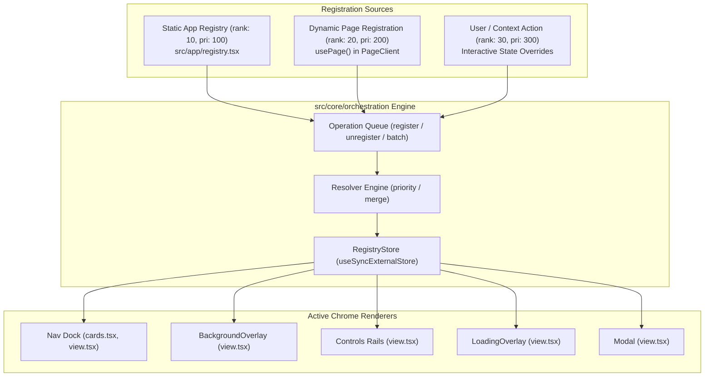
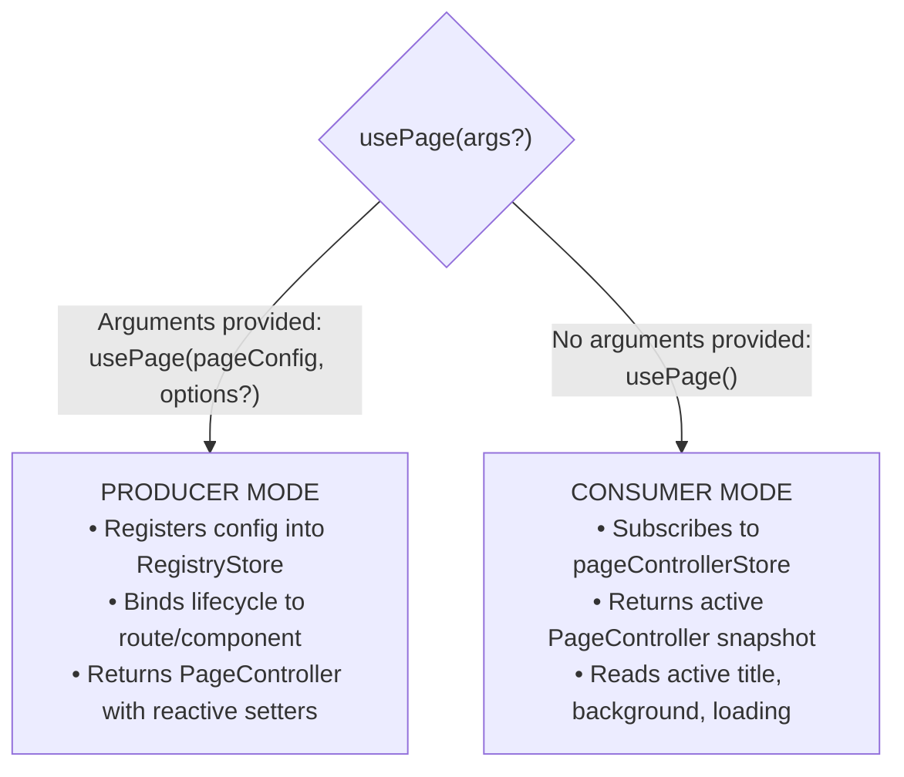

# Orchestration & Registry Architecture

The Orchestration Engine in `src/core/orchestration` is the central coordination subsystem of Base Framework. It enables pages, features, and route layouts to declaratively control application-wide chrome (Navigation dock, background media, modals, context menus, loading states, and screen rails) without direct component coupling or manual prop drilling.

---

## 1. Architectural Model & Precedence

The engine operates on an external reactive store (`RegistryStore`) that resolves entries by **source rank**, **priority**, and **lifecycle policies**:



---

## 2. Registry Types & Policies

Defined in [`src/core/orchestration/constants.ts`](file:///Users/omerdlw/Documents/Base%20Framework/src/core/orchestration/constants.ts):

| Registry Type (`REGISTRY_TYPES`) | Key Policy  | Default Resolver | Value Kind  | Default Lifecycle | Default Cleanup Delay | Purpose                                                            |
| :------------------------------- | :---------- | :--------------- | :---------- | :---------------- | :-------------------- | :----------------------------------------------------------------- |
| `NAV`                            | `path`      | `merge`          | `object`    | `route`           | 600ms                 | Dock card configuration, title, description, icon, banner, actions |
| `BACKGROUND`                     | `singleton` | `priority`       | `object`    | `immediate`       | 600ms                 | Page video/image background, blur, noise, edge fades               |
| `CONTROLS`                       | `named`     | `priority`       | `object`    | `immediate`       | None                  | Left/right side screen rail controls alongside the dock            |
| `LOADING`                        | `singleton` | `priority`       | `object`    | `graceful`        | 600ms                 | Global or localized loading indicators & skeletons                 |
| `MODAL`                          | `named`     | `priority`       | `component` | `immediate`       | 600ms                 | Modal component registry by unique name                            |
| `CONTEXT_MENU`                   | `route`     | `priority`       | `object`    | `immediate`       | 600ms                 | Right-click contextual action lists mapped to selectors/paths      |

### Source Rank & Precedence

When two entries conflict for the same key, the store resolves using **Source Rank** first, then numeric **Priority**:

1. `USER` (`rank: 30`, default priority `300`): Dynamic overrides triggered by user interactions.
2. `DYNAMIC` (`rank: 20`, default priority `200`): Route-level components registering config via `usePage()`.
3. `STATIC` (`rank: 10`, default priority `100`): Root configuration registered on boot via `APP_REGISTRY_ENTRIES`.

---

## 3. The `usePage()` Hook (Dual-Mode Engine)

Defined in [`src/core/orchestration/page-controller.tsx`](file:///Users/omerdlw/Documents/Base%20Framework/src/core/orchestration/page-controller.tsx#L94). `usePage` operates in two distinct modes depending on how it is invoked:



### 3.1 Producer Mode (Configuring a Page)

Used inside client-side page views (e.g. `src/app/client.tsx` or `src/app/account/[username]/client.tsx`):

```tsx
"use client";

import { usePage } from "@/core/orchestration";

export function CustomPageClient() {
  const page = usePage({
    // Navigation card metadata
    nav: {
      title: "Projects",
      description: "Explore portfolio works",
      icon: "solar:folder-with-files-bold",
    },
    // Background media configuration
    background: {
      video: "/media/ambient-loop.mp4",
      videoOptions: { autoplay: true, loop: true, muted: true },
      overlay: true,
      overlayOpacity: 0.4,
    },
    // Ambient theme injection (extract colors from image/video)
    ambient: {
      image: "/media/ambient-poster.jpg",
      tintGlobals: true,
    },
    // Contextual dock action buttons
    actions: [
      {
        key: "action.create",
        icon: "solar:add-circle-bold",
        tooltip: "New Project",
        onClick: () => console.log("Create clicked"),
      },
    ],
  });

  return (
    <main className="relative z-10 min-h-screen p-8">{/* Page Content */}</main>
  );
}
```

### 3.2 Consumer Mode (Reading / Mutating from Deep Child Components)

Any nested component down the tree can call `usePage()` with no arguments to inspect the active controller or execute runtime setters:

```tsx
"use client";

import { usePage } from "@/core/orchestration";

export function DeepChildWidget() {
  const page = usePage();

  const handleUpdate = () => {
    // Dynamically update title
    page.setTitle("Project #42 — In Progress");
    // Show toast
    page.toast.success("Project updated successfully");
    // Trigger loading overlay
    page.setLoading(true);
  };

  return <button onClick={handleUpdate}>Update Status</button>;
}
```

---

## 4. `PageController` API Reference

When `usePage` is called, it returns a `PageController` object with the following interface:

```typescript
export interface PageController {
  // Current effective resolved configuration
  config: PageConfig;

  // Granular reactive mutations
  set: (partial: Partial<PageConfig>) => void;
  reset: () => void;
  setTitle: (title: string) => void;
  setDescription: (description: string) => void;
  setIcon: (icon: any) => void;
  setBanner: (banner: any) => void;
  setNav: (navConfig: any) => void;
  setBackground: (background: string | PageBackgroundConfig) => void;
  setLoading: (loading: boolean | string | PageLoadingConfig) => void;
  setControls: (controls: any) => void;
  setActions: (actions: any[]) => void;
  setAmbient: (ambient: any) => void;

  // Background video transport
  background: {
    set: (bg: any) => void;
    setVideoPlaying: (playing: boolean) => void;
    toggleVideo: () => void;
    toggleMute: () => void;
  };

  // Surface & Modal management
  surface: (idOrDef: any, props?: Record<string, any>) => any;
  closeSurface: (id: string) => void;
  closeAllSurfaces: () => void;
  modal: (idOrDef: any, props?: Record<string, any>) => any;
  closeModal: (id: string) => void;
  closeAllModals: () => void;

  // Toast notifications
  toast: ToastController;
}
```

---

## 5. App Route Registry (`src/app/registry.tsx`)

The website declares its base static routes and modal mappings in `src/app/registry.tsx`. This file is frozen at boot time and provided to `CoreProvider`:

```tsx
import dynamic from "next/dynamic";
import { REGISTRY_TYPES, type AppRegistryEntry } from "@/core/orchestration";

const NotificationsModal = dynamic(
  () =>
    import("@/features/account/social/components/modals/notifications-modal"),
  { ssr: false },
);

export const APP_REGISTRY_ENTRIES: readonly AppRegistryEntry[] = Object.freeze([
  {
    type: REGISTRY_TYPES.NAV,
    items: {
      "/": {
        description: "Overview",
        icon: "solar:home-2-bold",
        path: "/",
        title: "Home",
      },
      "/account": {
        description: "Manage your account",
        icon: "solar:user-circle-bold",
        path: "/account",
        title: "Account",
      },
    },
  },
  {
    type: REGISTRY_TYPES.MODAL,
    items: {
      NOTIFICATIONS_MODAL: NotificationsModal,
    },
  },
]);
```

### How Registry Bootstrap Works

In [`src/app/providers.tsx`](file:///Users/omerdlw/Documents/Base%20Framework/src/app/providers.tsx), `CoreProvider` accepts `registryEntries = APP_REGISTRY_ENTRIES`.  
Internally, `RegistryProvider` in `src/core/orchestration/provider.tsx` registers these entries with `source: STATIC`, establishing baseline navigation before any route renders.

---

## 6. Scopes, Lifecycles & Diagnostics

### Lifecycles (`REGISTRY_LIFECYCLES`)

1. `IMMEDIATE`: Unregisters immediately when the unregister operation occurs or component unmounts.
2. `GRACEFUL` (default for `LOADING`): Holds cleanup for a configured grace period (e.g. `cleanupDelayMs: 600`) to prevent visual flickering.
3. `PERSISTENT`: Survives component unmounts. Only cleared on explicit unregistration.
4. `ROUTE` (default for `NAV`): Bound to Next.js route transitions. Cleaned up when navigating away unless marked `keepWhenDescendant`.

### Diagnostics

The engine maintains an in-memory audit log of the last 200 operations (`MAX_DIAGNOSTICS = 200`):

- Tracks operations: `register`, `unregister`, `superseded`, `validation-warning`, `reject`.
- Accessible via `getRegistryDiagnostics()` and hook `useRegistryDiagnostics()`.
